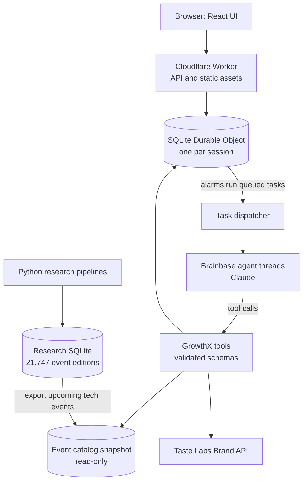

# GrowthX — your autonomous event team

**Paste your company's website. A team of agents finds the right rooms, plans the right gatherings and turns event opportunities into action.**

- Live: <https://growthx-event-team.mpulitano1701.workers.dev/>
- Prepared demo: <https://growthx-event-team.mpulitano1701.workers.dev/demo>

Built at the Startup Speedrun Hackathon (September 28, 2026) for the **Autonomous Organizations** track.

## The idea

Startups spend real money on events, but most of those choices come from stale directories, a sponsor logo wall and a hunch. Doing it properly takes a growth person days: finding the rooms where the buyers actually are, what they really cost, who to talk to, and what to host yourself. Listing events is already a commodity. The value is in deciding what to do, backing it with evidence, and acting on it.

GrowthX hands that job to a team of agents:

1. **You paste your website.** The Taste Labs Brand API reads your logo, imagery, palette, typography and audience.
2. **You give a short brief:** a goal, who you want in the room and a budget.
3. **The team gets to work on its own.** Four agents coordinate through persisted tasks:
   - **Noa (Lead)** decides the next move and proposes an original event you could host.
   - **Ari (Producer)** designs that event, writes the invitation and builds a private landing page in your brand.
   - **Atlas (Scout)** searches an evidence-backed catalog of upcoming events and can only save an opportunity it has inspected.
   - **June (Partnerships)** drafts sponsorship inquiries and interprets organizer replies so the Lead can replan.
4. **You watch, steer and approve.** Every draft is editable, and every claim links to its source.

Nothing irreversible happens without a human. The agents never send email, buy a sponsorship or publish a registration.

## Architecture



- **Coordination through state, not chat.** Agents never call each other directly. Each task ends with a structured result and can queue one follow-up task for another role, so every handoff is a stored record that the UI shows as a live timeline.
- **Durable by default.** Each session gets its own SQLite Durable Object holding the brief, tasks, opportunities, evidence, draft revisions and activity. Durable Object alarms run the queued tasks, so work survives restarts and failed tasks can be retried.
- **Agents decide, code enforces.** Each role runs as a managed Brainbase thread backed by Claude. The tools run inside GrowthX, where they validate inputs, check evidence IDs against the catalog and cap tasks, tool calls and retries.
- **Evidence first.** The catalog comes from open-licensed sources (confs.tech, conferences.computer.science, Helsinki Linked Events). Every record keeps its source IDs. The app reads it in read-only mode.

For local development, the same agent runtime runs in a Next.js app with a separate queue worker that calls the Anthropic API directly.

## Repository

| Path | What it holds |
|---|---|
| `web/` | The app: Next.js for local development and `web/cloudflare/` for the Worker build |
| `event-gtm-2026-09-28/` | The research catalog, its evidence and the Python pipelines that built it |
| `docs/` | Product definition, deployment notes and design documents |

## Running it

Requires Node.js 22.13 or later and pnpm 11.8.0.

```sh
# Restore the research catalog once (from the repo root)
gunzip -k event-gtm-2026-09-28/scale-expansion-20260928/dataset.sqlite.gz

cd web
pnpm install --frozen-lockfile
cp .env.example .env.local   # then add your own keys
pnpm dev                     # app on http://localhost:3010
pnpm worker                  # agent worker, in a second terminal
```

To deploy to Cloudflare, set `BRAINBASE_API_KEY`, `TASTE_API_KEY` and `SESSION_SECRET` as Wrangler secrets, then run `pnpm deploy` from `web/`.

## Learn more

- [Product definition](docs/product-definition.md) (Spanish) and the original [hackathon brief](HACKATHON_BUILD_BRIEF.md)
- [Cloudflare, Brainbase and Taste deployment](docs/cloudflare-brainbase.md)
- [Research catalog](event-gtm-2026-09-28/README.md)

Some UI and utility code (the MapLibre map, date utilities and evidence helpers) was adapted from our earlier open-source project, [GrowthX-for-hackaton](https://github.com/Julian0444/GrowthX-for-hackaton).
