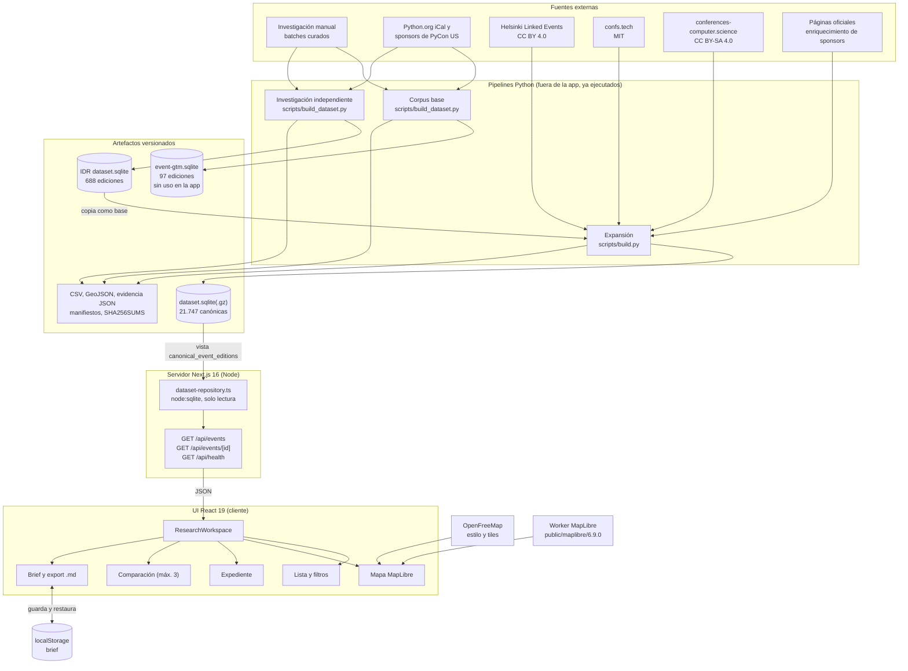
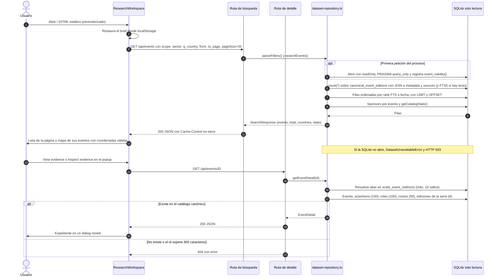
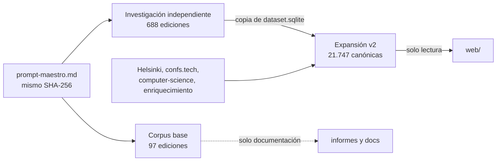
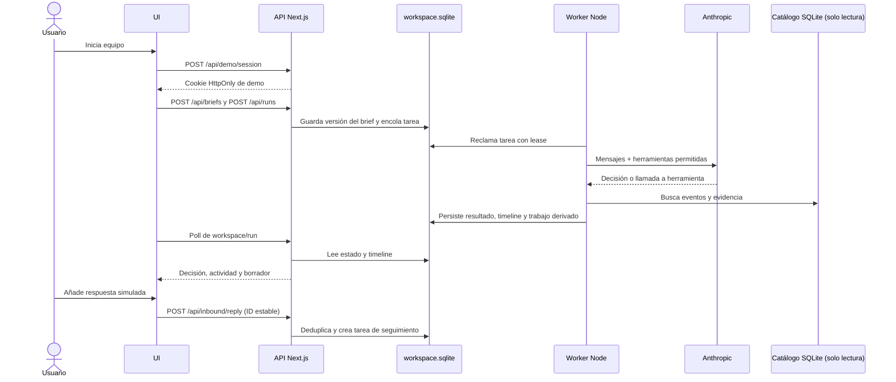

> Live GrowthX: https://growthx-event-team.mpulitano1701.workers.dev/ · [Brainbase, Taste and Cloudflare deployment](docs/cloudflare-brainbase.md)

# Event GTM

Event GTM (nombre de trabajo: Growth Atlas) combina una base de investigación de eventos con una aplicación web para consultar ediciones, comparar alternativas y revisar la evidencia de cada dato. Está pensada para equipos de growth y field marketing que deciden a qué eventos ir, dónde hablar o qué patrocinar.

**Entrega inicial del backend (antes de integrar Cloudflare y Brainbase):** `web/` combina un catálogo SQLite de solo lectura (21.747 ediciones canónicas) con un workspace de demo persistente, un worker de agentes de cuatro roles y una línea de tiempo. El backend tiene runtime con herramientas acotadas, persistencia operacional separada y respuesta de organizador simulada. Lead, Scout y Partnerships completaron tareas reales con Anthropic. Producer está implementado y cubierto por tests, pero su prueba real no completó el borrador: agotó primero el tiempo de espera y después el límite de salida del modelo. El cierre de esta entrega es solo de backend; el equipo se encarga de la conexión con el frontend y se conserva el diseño existente.

La [entrega del backend de agentes](docs/hackathon-demo.md) documenta las rutas, el arranque y los pendientes.

La aplicación reutiliza selectivamente módulos de [GrowthX / Growth Atlas](https://github.com/Julian0444/GrowthX-for-hackaton). Lee el catálogo en modo de solo lectura. Los archivos originales de `event-gtm-2026-09-28/` conservan su estructura.

Repositorio: `https://github.com/MartinPuli/speed-hack.git`. Para empezar rápido, ir a [Arranque rápido](#arranque-rápido).

---

## Índice

1. [Estado actual](#estado-actual)
2. [Arquitectura](#arquitectura)
3. [Flujo de una consulta](#flujo-de-una-consulta)
4. [Estructura del repositorio](#estructura-del-repositorio)
5. [Aplicación web](#aplicación-web)
6. [Datos](#datos)
7. [Arranque rápido](#arranque-rápido)
8. [Por dónde empezar a leer](#por-dónde-empezar-a-leer)
9. [Configuración](#configuración)
10. [Verificación y scripts](#verificación-y-scripts)
11. [Solución de problemas](#solución-de-problemas)
12. [Regenerar los datos](#regenerar-los-datos)
13. [Principios y limitaciones](#principios-y-limitaciones)
14. [Hoja de ruta](#hoja-de-ruta)
15. [Problemas conocidos](#problemas-conocidos)
16. [Documentación relacionada](#documentación-relacionada)

---

## Estado actual

Verificación de cierre del backend (**2026-09-28**): 44 tests, TypeScript y build pasan. Las observaciones de interfaz de esta sección corresponden a la revisión anterior; no se revalidó la interfaz actual de Taste en este cierre.

Leyenda: ✅ funciona · 🟡 parcial o con defectos · ⛔ falta

### Funcionalidades de la app

| Funcionalidad | Estado | Evidencia / notas |
|---|---|---|
| Catálogo SQLite en solo lectura (`readOnly` + `PRAGMA query_only`) | ✅ | `lib/server/dataset-repository.ts:71-72`. Los tests comprueban que tamaño y mtime del archivo no cambian |
| `GET /api/health` | ✅ | 200: total 21.747, upcoming 258, 453 relaciones sponsor, 276 empresas, cutoff 2026-09-28 |
| Búsqueda de texto (FTS5), filtros y paginación | ✅ | Por defecto (upcoming + tech): 255 resultados. Filtros de país, fechas, horizonte y sector. Parámetros inválidos se normalizan sin error |
| Búsqueda semántica o por prefijo | ⛔ | Solo tokens exactos unidos con OR. `q=python` no encuentra PyBay 2026 |
| Expediente del evento (evidencia, roles, costos, ediciones relacionadas) | ✅ | Modal `<dialog>` con carga bajo demanda. Resuelve alias (`scale_event_redirects`) |
| Mapa MapLibre + OpenFreeMap con precisión visible | ✅ | Estado `ready` en ~1,6 s. En la página 1 hay 4 de 20 eventos mapeables, todos centroides de ciudad (`≈`) |
| Respaldo cuando el mapa falla | 🟡 | Muestra "Map unavailable" y la lista sigue. Pero los controles de zoom quedan encima del aviso, y cualquier evento `error` de MapLibre tras la carga activa el respaldo |
| Agrupación de pines | 🟡 | Solo agrupa coordenadas idénticas. No hay clustering por zoom |
| Comparación de hasta 3 eventos | ✅ | Tabla de 7 filas. Los costos se piden por evento |
| Brief de empresa (11 campos, `localStorage`) | 🟡 | Persiste y aplica temas, país y fechas. Un website sin `https://` bloquea "Apply to catalog" por validación nativa. Audiencia, objetivo y presupuesto no filtran |
| Exportación Markdown del brief + selección | ✅ | Descarga `event-gtm-research-brief.md` generado en el navegador |
| Persistencia de la selección (shortlist) | ⛔ | Solo estado de React. Se pierde al recargar |
| Etiquetado temporal (upcoming / today / past / undated) | 🟡 | Una fecha sin zona cercana a "ahora" queda fuera de Upcoming y de History (solo aparece en "All dates"), etiquetada `today` o `undated` |
| Responsive (390 px) | ✅ | Sin desbordamiento horizontal. El mapa pasa encima de la lista a ≤950 px |
| Accesibilidad básica | 🟡 | Skip link, `aria-*`, regiones live y foco visible. Al cerrar el expediente el foco no vuelve al botón que lo abrió |
| Idioma | 🟡 | La interfaz está en inglés. La evidencia del dataset y parte del código están en español. No hay capa i18n |
| Favicon | ⛔ | `/favicon.ico` devuelve 404 (único error de consola) |

### Producto del hackathon (P0)

| Pieza | Estado |
|---|---|
| Cuenta / login | 🟡 Sesión de demo compartida con cookie segura; no hay usuarios ni membresías |
| Workspace persistente en servidor | ✅ SQLite operacional separada e ignorada por Git; el catálogo permanece de solo lectura |
| Onboarding desde el website | ⛔ El brief se puede completar manualmente; no hay extracción ni propuesta de perfil desde una web |
| Cuatro roles, tareas durables, worker y línea de tiempo | ✅ Runtime Lead, Scout, Partnerships y Producer con herramientas permitidas, reintentos acotados y persistencia. Lead, Scout y Partnerships completaron tareas reales; la finalización real de Producer queda pendiente |
| Estados de oportunidad en lista y mapa | ✅ Estados semánticos, filtro de ciudad y top 3 por fit guardado; la fórmula/ajuste comercial del fit aún necesita evaluación |
| Respuesta entrante del organizador | ✅ Fixture de demo marcado como simulado, persistido e idempotente; genera trabajo posterior para los agentes |
| Borrador privado para Luma | 🟡 Persistencia y control de versiones cubiertos por tests; el recorrido real de Producer no completó el borrador. Integración frontend a cargo del equipo |
| Puntuación de oportunidades | 🟡 Se ordena por el fit que propone Lead y se muestra la razón; falta evaluar calibración contra el brief y costos verificados |

### Verificación (2026-09-28)

| Comprobación | Resultado |
|---|---|
| `pnpm test` | ✅ 44/44 |
| `pnpm typecheck` (`tsc --noEmit`) | ✅ sin diagnósticos |
| `pnpm lint` (`eslint .`) | 🟡 2 errores existentes en `map-first-workspace.tsx` y `onboarding.tsx` (enlaces a `/`), más 4 avisos de imágenes; fuera del cambio de backend |
| `pnpm build` (`next build --webpack`) | ✅ Build de producción en una copia aislada |
| `next dev` + smoke HTTP | ✅ `/api/health` responde 200; catálogo 21.747 y modo `read-only` |
| `pnpm test:browser` contra `:3010` | Pasó en la interfaz anterior. No se reejecutó sobre Taste; este cierre no cambia el frontend |
| Integridad del catálogo | ✅ SHA-256 `8e1973…50cc`, 338.649.088 bytes. Coincide con [la verificación del traslado](docs/growthx-transfer-verification-20260928.md) |

Node 22 también emite `ExperimentalWarning: SQLite is an experimental feature` por `node:sqlite`; no es un fallo de las pruebas.

---

## Arquitectura



### Capas

| Capa | Qué hace | Dónde |
|---|---|---|
| **Fuentes externas** | Calendarios, listados abiertos, API municipal de Helsinki y páginas oficiales. Se consultaron el 28-sep-2026. Ningún script corre en la app | Ver [Datos](#datos) |
| **Pipelines Python** | Tres ejecuciones. El corpus base y la investigación independiente (IDR) son independientes entre sí. La expansión parte de una copia de la SQLite de IDR y le añade lotes normalizados. Los pasos de construcción usan solo la biblioteca estándar; la adquisición usa `requests`, `bs4` y `pypdf` | `event-gtm-2026-09-28/**/scripts/` |
| **Artefactos** | SQLite, espejos CSV, extractos de evidencia JSON, mapas GeoJSON, manifiestos con hashes. La app solo usa `scale-expansion-20260928/dataset.sqlite` | `event-gtm-2026-09-28/` |
| **Servidor Next.js** | Catálogo de solo lectura más API del workspace de demo. `dataset-repository.ts` usa la SQLite del catálogo; `workspace/repository.ts` mantiene otra SQLite escribible para sesiones, briefs, tareas y borradores | `web/lib/server/`, `web/app/api/` |
| **UI React** | Una sola página. `/` es un shell estático prerenderizado; todos los datos se piden desde el cliente. Estado con `useState`/`useEffect`, sin router, store global ni librería de datos | `web/components/`, `web/app/page.tsx` |
| **Navegador** | Solo el brief se guarda (`localStorage`). Los filtros no van en la URL y la selección no se guarda | `research-workspace.tsx:19` |

El corpus base (`event-gtm.sqlite`) es documentación y contexto. Ningún archivo de `web/` lo referencia.

---

## Flujo de una consulta



Detalles del flujo:

- Editar el texto o los selectores no busca hasta enviar el formulario (Search o Enter). También lanzan una búsqueda la carga inicial, "Apply to catalog", "Reset filters", la paginación y "Retry search". No hay debounce, y cada petición nueva cancela la anterior (`AbortController`).
- `scope=upcoming` excluye estados que contienen `cancel` y exige `event_validity(...) = 'upcoming'`. `scope=history` exige `'past'`. `scope=all` no filtra por tiempo.
- `sector=tech` equivale a `sector` o `category` en `technology` / `academic-technology`.
- Con texto, el orden es rank FTS5 (bm25), luego fecha y luego id. Sin texto, fecha ascendente (descendente en `history`) y luego id.
- La lista de países (103) se calcula una vez por conexión y no depende de los filtros.

---

## Estructura del repositorio

```text
speed-hack/
├── README.md                          este documento
├── HACKATHON_BUILD_BRIEF.md           spec del hackathon (manda si hay conflicto)
├── docs/
│   ├── product-definition.md          producto, agentes, P0/P1, guion de demo
│   ├── growthx-reuse.md               qué se trajo de GrowthX y qué no
│   └── growthx-transfer-verification-20260928.md
├── web/                               única app ejecutable (Next.js)
│   ├── app/
│   │   ├── layout.tsx, page.tsx, globals.css
│   │   └── api/{events, events/[id], health}/route.ts
│   ├── components/
│   │   ├── research-workspace.tsx     shell y dueño del estado
│   │   ├── research-brief.tsx         formulario del brief
│   │   └── events/                    lista, mapa, expediente, comparación, enlaces
│   ├── lib/
│   │   ├── server/dataset-repository.ts   acceso a SQLite (solo servidor)
│   │   ├── contracts/event-gtm.ts         tipos compartidos UI/API
│   │   ├── temporal/  evidence/  map/  drafts/  recommendations/
│   ├── scripts/copy-maplibre-worker.mjs
│   ├── tests/                         3 archivos node:test + browser-smoke.mjs
│   ├── .env.example
│   └── package.json, pnpm-lock.yaml, pnpm-workspace.yaml (allowBuilds),
│       tsconfig.json, eslint.config.mjs, next.config.mjs, next-env.d.ts
└── event-gtm-2026-09-28/              investigación (datos, no código de la app)
    ├── README.md, resumen-ejecutivo.md, quality_report.md, validation_report.md, …
    ├── event-gtm.sqlite               corpus base, 97 ediciones (la app no lo lee)
    ├── observed/ derived/ private-schemas/   espejo CSV de las 66 tablas (49 + 15 + 2)
    │                                  más derived/map_candidates.csv (no es tabla)
    ├── evidence/                      252 extractos JSON con hash
    ├── batches/ inputs/ checkpoints/ reports/ scripts/
    ├── event-gtm-research.zip, SHA256SUMS.txt
    ├── independent-deep-research-20260928/  688 ediciones, semilla de la expansión
    │   └── dataset.sqlite, data/, scripts/, phase2/, spec/prompt-maestro.md
    └── scale-expansion-20260928/      catálogo que lee la app
        ├── dataset.sqlite.gz          versionado en git (59.093.460 bytes)
        ├── dataset.sqlite             ignorado por git (338.649.088 bytes)
        ├── batches/ manifests/ evidence/enrichment/ scripts/ reports/ examples/
        ├── maps/opportunities.*       actual (generado con la SQLite vigente)
        └── exports/ maps/events.* qa-results.json …   ⚠ de un build anterior
```

Generado y fuera de git: `web/node_modules/`, `web/.next/`, `web/public/maplibre/`, `web/test-results/`, `web/*.tsbuildinfo`, `web/.env*` (salvo `.env.example`) y `web/.data/` (reservado para el futuro workspace). Ver [`.gitignore`](.gitignore).

---

## Aplicación web

### Stack

| Pieza | Versión |
|---|---|
| Next.js (App Router, ejecutado con `--webpack`) | 16.2.6 |
| React / React DOM | 19.2.4 |
| TypeScript | 5.7.3 |
| maplibre-gl | 6.9.0 |
| lucide-react | 1.17.0 |
| Playwright (dev) | 1.58.2 |
| tsx (dev) | 4.23.15 (`^4.20.0`) |
| eslint (dev) / eslint-config-next (dev) | 9.39.5 (`^9`) / 16.2.6 |
| @types/node (dev) | `^24` |
| Node.js | `>=22.13.0` (`node:sqlite` con `DatabaseSync` y `db.function`). Observado: v22.23.2 |
| pnpm | 11.8.0 (`packageManager`). `pnpm-workspace.yaml` autoriza los scripts de build de `esbuild`, `sharp` y `unrs-resolver` |

No hay dependencias de base de datos, autenticación ni LLM.

### Endpoints

Las tres rutas declaran `runtime = 'nodejs'` y `dynamic = 'force-dynamic'`. No hay rutas de escritura.

| Método | Ruta | Parámetros | Respuesta |
|---|---|---|---|
| GET | `/api/events` | `q` (≤500 caracteres, hasta 16 tokens de 2 a 48 caracteres, stopwords EN/ES eliminadas), `scope` = `upcoming` (defecto) · `history` · `all`, `sector` = `tech` (defecto, cualquier valor ≠ `all`) · `all`, `country` (coincidencia exacta sin mayúsculas, ≤100 caracteres), `from` / `to` (`YYYY-MM-DD`; inválidas se ignoran), `page` (1..100000, se ajusta a `totalPages`), `pageSize` (defecto 24, máx. 50; la UI envía 20) | 200 `SearchResponse` `{events, total, page, pageSize, totalPages, evaluatedAt, countries, stats}` con `Cache-Control: no-store`. 503 si el catálogo no abre. 500 ante otro error |
| GET | `/api/events/[id]` | `id` (≤300 caracteres; los alias se resuelven) | 200 `EventDetail` = resumen + `evidence` (≤100, más recientes primero), `evidenceTotal`, `roles` (≤100), `costs` (≤50), `relatedEditions` (≤6, misma `series_id`). 404, 503 o 500 con `{error}` |
| GET | `/api/health` | — | 200 `{status:'ok', catalog:{total, upcoming, sponsorRelations, sponsorCompanies, cutoff}, catalogMode:'read-only'}` o 503 `{status:'unavailable', error}` ante **cualquier** excepción, no solo si falta el archivo. La UI no la usa |

Ejemplos (con el servidor en marcha):

```sh
curl -s http://localhost:3010/api/health
curl -s 'http://localhost:3010/api/events?q=python&scope=all&pageSize=5'
curl -s http://localhost:3010/api/events/evt_dd36adad3729b7b4   # PyCon US 2023: 14 evidencias, 100 roles (de 102; límite de la API), 4 ediciones relacionadas
```

Convención de IDs: las ediciones heredadas de la investigación independiente usan `evt_` + 16 hex (por ejemplo, PyBay 2026 es `evt_9da972220c78ac0f`). Las creadas por la expansión usan `evt2_` + 24 hex.

Latencias medidas en caliente contra el servidor de desarrollo: `/api/health` 55–66 ms, `/api/events` por defecto 158–171 ms, `q=python&scope=all` ~56 ms, detalle 10–12 ms.

Los tipos de la respuesta están en [`web/lib/contracts/event-gtm.ts`](web/lib/contracts/event-gtm.ts). Las formas de error y de `/api/health` no tienen tipo.

### Componentes

| Componente | Archivo | Responsabilidad |
|---|---|---|
| `ResearchWorkspace` | `components/research-workspace.tsx` | Shell cliente y único dueño del estado. Vistas catalog / comparison, formulario de filtros, paginación, estados de carga, error y vacío, `fetch` con `AbortController`, brief en `localStorage`, selección de hasta 3 eventos |
| `ResearchBriefPanel` | `components/research-brief.tsx` | `<details>` con 11 campos (empresa, website, objetivo, audiencia, temas, geografía, desde/hasta, presupuesto, moneda, restricciones). "Apply to catalog" traslada temas → `q`, geografía → `country` (si coincide exactamente) y fechas |
| `EventList` | `components/events/event-list.tsx` | Filas de resultados con checkbox para comparar, estado temporal, temas, conteo de sponsors y "View evidence" |
| `EventMap` / `MapCanvas` / `LocationPin` / `EventPopup` | `components/events/event-map.tsx`, `event-map.css` | Mapa de la página actual, carga diferida de `maplibre-gl`, "Fit results", popup con "Inspect evidence", respaldo con "Retry map" |
| `EventDossier` | `components/events/event-dossier.tsx` | `<dialog>` modal: What is documented, Location and precision, Organizations and roles, Documented costs, Evidence by field, Before you decide, Related editions |
| `ComparisonPanel` | `components/events/comparison-panel.tsx` | Tabla lado a lado: fecha, ubicación, temas, costos registrados, historial de sponsors, qué falta y fuentes |
| `PublicLink` / `SourceLinks` | `components/events/evidence-links.tsx` | Enlaces solo si la URL es pública (`evidenceLink`) |
| Helpers de formato | `components/events/display.ts` | Fechas, ubicación, etiquetas temporales, texto de costos |

### Módulos de `lib/`

| Módulo | Uso en la app |
|---|---|
| `server/dataset-repository.ts` | ✅ Todas las rutas API |
| `contracts/event-gtm.ts` | ✅ UI y API |
| `temporal/event-validity.ts` + `calendar-validation.ts` | ✅ Servidor (también como UDF SQL `event_validity`) |
| `evidence/source-link.ts` → `evidenceLink` | ✅ Mapa, enlaces de evidencia, exportación, puntos del mapa |
| `map/event-points.ts` | ✅ Mapa |
| `drafts/export.ts` → `composeResearchBrief`, `downloadResearchBrief` | ✅ Botón "Export brief" |
| `drafts/export.ts` → `copyText` | ⛔ Sin uso ni tests |
| `evidence/source-link.ts` → `sourceLink`, `sameEvidenceUrl` | Solo tests |
| `temporal/declared-date.ts`, `temporal/display-date.ts`, `temporal/types.ts` | Solo tests |
| `evidence/calendar.ts` | Solo tests |
| `recommendations/score-utils.ts` | Solo tests (la UI declara "no commercial score") |

Los módulos que solo usan los tests están disponibles para la siguiente fase (ver [growthx-reuse.md](docs/growthx-reuse.md)).

### Política temporal

`classifyEventValidity()` (en `lib/temporal/event-validity.ts`) devuelve `upcoming`, `past`, `date_pending` o `date_ambiguous`:

- Una fecha u hora **sin zona** se evalúa contra todo el rango UTC−12 … UTC+14. Solo es `past` o `upcoming` si lo es en cualquier zona. Nunca se inventa una zona.
- Una fecha ausente o imposible (por ejemplo `2026-02-30`) es `date_pending`. Nunca se sustituye por la fecha de publicación ni por "ahora".
- Un inicio exacto igual al instante de evaluación cuenta como pasado.

La API traduce esto a `TemporalStatus`: `past`, `today` (fecha de inicio igual a la fecha UTC actual), `upcoming` o `undated` (todo lo demás, incluso fechas conocidas pero ambiguas; ver [Problemas conocidos](#problemas-conocidos)).

### Persistencia en el navegador

| Clave | Contenido | Notas |
|---|---|---|
| `event-gtm:research-brief:v1` (`localStorage`) | JSON del `ResearchBrief` (11 campos) | Se escribe en cada edición. Al restaurar se descartan cadenas de más de 10.000 caracteres. Es el **único** estado persistido |

Ni los filtros ni la selección de comparación se guardan, y no se reflejan en la URL. La exportación se genera en el navegador (`text/markdown`) y no se envía al servidor.

### Mapa

- **Estilo y tiles:** `https://tiles.openfreemap.org/styles/liberty` (OpenFreeMap, sin API key). Atribución "OpenFreeMap © OpenMapTiles Data from OpenStreetMap".
- **Worker:** `scripts/copy-maplibre-worker.mjs` copia `maplibre-gl-worker.mjs` y `maplibre-gl-shared.mjs` a `web/public/maplibre/<versión>/` antes de `dev` y `build`. El cliente llama a `setWorkerUrl('/maplibre/6.9.0/maplibre-gl-worker.mjs')`. La carpeta está en `.gitignore`.
- **Qué se dibuja:** solo la página actual (máx. 50 eventos; en la práctica 20). `eventPoint()` descarta coordenadas nulas, fuera de rango o `(0,0)`, precisión desconocida o no geocodificada, y eventos sin URL de fuente pública.
- **Precisión:**
  - `≈` con borde discontinuo marca un **centroide de ciudad**, un área aproximada y no la sede.
  - `•` marca un **punto publicado por la fuente**, sin verificación independiente.
  - Las coordenadas idénticas se agrupan con un contador y nunca se desplazan.
- **Encuadre:** "Fit results" hace zoom máximo 7 si todos los puntos son aproximados y 12 en otro caso.
- **Respaldo:** tras 15 s sin cargar, o ante un error, se muestra "Map unavailable" con "Retry map". La lista sigue funcionando.
- **Cobertura real:** 42 de las 269 ediciones con inicio ≥ 2026-09-28 tienen coordenadas, todas centroides de ciudad. En la vista por defecto se mapean 4 de 20. Una búsqueda "San Francisco" (upcoming, tech) da 7 eventos y 0 puntos.

---

## Datos

### Tres corpus

| Corpus | Ruta | Ediciones | Otros conteos | Rol |
|---|---|---|---|---|
| **Base** | `event-gtm-2026-09-28/event-gtm.sqlite` (5.357.568 bytes) | 97 (42 series) | 259 fuentes, 5.961 assertions, 380 empresas, 665 roles (410 sponsor), 49 recintos sin coordenadas. 66 tablas, 23 vacías | Investigación documental original. **La app no lo lee** |
| **Investigación independiente (IDR)** | `event-gtm-2026-09-28/independent-deep-research-20260928/dataset.sqlite` (12.136.448 bytes) | 688 (650 históricas, 38 futuras) | 160 fuentes, 21.570 assertions, 288 organizaciones, 468 roles (320 sponsor), 0 coordenadas. 66 tablas | Segunda ejecución del mismo prompt maestro (mismo SHA-256). **Semilla** de la expansión |
| **Expansión v2** | `event-gtm-2026-09-28/scale-expansion-20260928/dataset.sqlite` (338.649.088 bytes; `.gz` de 59.093.460 bytes) | 21.749 físicas / **21.747 canónicas** | 461.419 assertions, 608 fuentes, 607 roles (453 sponsor), 374 empresas, 18.026 ediciones con coordenadas. 74 tablas (66 heredadas + 8 `scale_*`), la tabla virtual FTS5 `scale_event_search` con sus 5 tablas internas (80 entradas `table` en `sqlite_master`) y 1 vista | **Fuente de la app** |



La expansión **sí hereda** la investigación independiente: `scale-expansion-20260928/scripts/build.py` copia su `dataset.sqlite` como base. 686 de sus 688 ediciones están en la vista canónica y las otras 2 son alias redirigidos. El corpus base de 97 ediciones es el único que queda fuera.

### Vista canónica

```sql
CREATE VIEW canonical_event_editions AS
  SELECT * FROM event_editions
  WHERE id NOT IN (SELECT alias_event_id FROM scale_event_redirects);
```

Tablas que lee la app: la vista `canonical_event_editions` (nunca consulta `event_editions` directamente), `scale_event_metadata` (ciudad, país normalizado, categoría, lat/lng, precisión, licencia), `sources`, `scale_event_search` (FTS5 sobre `title`, `location`, `topics`), `scale_event_redirects` (2 filas), `event_company_roles`, `companies`, `event_costs`, `assertions`.

### Composición de la expansión

| Familia de fuente | Ediciones canónicas | Licencia |
|---|---|---|
| Helsinki Linked Events (muestra municipal, 2021-09-28 … 2024-08-28) | 17.629 (81 %) | CC BY 4.0 |
| confs.tech | 2.949 | MIT |
| Heredadas de IDR | 686 | Solo hechos públicos; derechos de reutilización comercial no verificados (`commercial_reuse_not_cleared`) |
| conferences-computer.science | 480 | CC BY-SA 4.0 |
| Enriquecimiento primario (FOSDEM 2024, KubeCon Japan e India 2025) | 3 | Evidencia factual pública sin licencia de redistribución |

Otros datos de la expansión:

- **Enriquecimiento:** 162 assertions. Casi todas vienen de páginas oficiales y PDF (FOSDEM 2024–2026, KubeCon Japan/India 2025, informes de transparencia de CNCF, PyCon AU 2025); 4 vienen de páginas de empresa (ClickHouse, Valkey, Snowflake). Afectan a 6 ediciones, 3 de ellas nuevas. QA `PASS` en `reports/enrichment_qa.json`.
- **Estrato tech:** 4.087 ediciones. De ellas, 266 tienen inicio ≥ 2026-09-28. La política conservadora de la app cuenta 255 upcoming tech y 258 en total.
- **Ediciones futuras (269 con inicio ≥ 2026-09-28, todos los sectores):** confs.tech 189, computer-science 42, heredadas de IDR 38, Helsinki 0. La muestra de Helsinki termina en 2024-08, así que su 81 % es enteramente histórico. Las 42 futuras con coordenadas son centroides de ciudad de computer-science.
- **Fechas:** del 2021-09-28 al 2027-11-30. Todas las canónicas tienen `start_date`.
- **Países:** 103 distintos. Finlandia tiene 17.582 ediciones y 780 no tienen país.
- **Precisión geográfica (canónicas):**
  - Con coordenadas: `source_published_point_accuracy_unspecified` 17.563 (Helsinki) y `city_centroid_publisher_gazetteer` 463 (computer-science).
  - Sin coordenadas: `unlocated` 3.035, `location_text_ungeocoded` 667, `unknown` 16 y `published_address_ungeocoded` 3.
- **Sponsors y costos:**
  - 453 relaciones sponsor con 276 empresas, en 21 ediciones.
  - Ninguna edición tech próxima tiene sponsors. La única edición próxima con fila sponsor es Frieze London 2026, que no es tech.
  - `event_costs` tiene 4 filas en 2 eventos: tarifas de hotel de PyCon US 2024 y 2025.

### Modelo de capas: evidencia → observado → derivado

1. **Fuentes y evidencia.**
   - `sources` guarda URL, editor, `observed_at` y `reuse_status`.
   - `assertions` guarda un registro por campo y valor: `entity_table`, `entity_id`, `field`, `value_json`, `source_id`, `locator`, `evidence_class` y `conflict_status`.
   - En la expansión, `scale_observations` conserva el payload normalizado de cada observación.
2. **Observado.** `event_editions`, `companies`, `event_company_roles`, `event_costs`, `venues` y el resto de tablas factuales. Un nulo tiene un motivo:
   - En el corpus base (`event-gtm.sqlite`), cada tabla lleva `extra_json` y `missing_reasons_json`.
   - En IDR y en la expansión no hay `extra_json`, y solo `event_editions`, `companies`, `sponsor_profiles` y `people` llevan `missing_reasons_json`.
3. **Derivado.** Clasificaciones, "presencia repetida" (`sponsorship_renewals`), corridas de evaluación, conceptos y borradores locales de Luma. Son hipótesis, no evidencia.
4. **Esquemas privados.** `customer_briefs` y `user_feedback` son solo cabeceras (0 filas). No se inventan clientes.

### Integridad

| Qué | Cómo verificar | Resultado 2026-09-28 |
|---|---|---|
| Expansión: `.gz` ↔ `.sqlite` | `gunzip -c dataset.sqlite.gz \| shasum -a 256` y `shasum -a 256 dataset.sqlite` | Ambos `8e197337639981996c70f9225f0c4e9e7cbca6c358d2bc8ac31e603502b850cc` |
| Expansión: archivo `.gz` | `shasum -a 256 dataset.sqlite.gz` | `9cb16176dea71578d1721e57b74e8937730581873b8f8d941dcf60f355b9d950` |
| Expansión: consistencia SQLite | `sqlite3 -readonly dataset.sqlite 'pragma quick_check; pragma foreign_key_check'` | `ok`, sin violaciones |
| Corpus base: zip | `cd event-gtm-2026-09-28 && shasum -a 256 -c SHA256SUMS.txt` | `event-gtm-research.zip: OK` |
| Corpus base: hashes de archivos | `dataset_manifest.json` (490 archivos) | 490/490 coinciden |
| Corpus base: SQLite | `sqlite3 -readonly event-gtm.sqlite 'pragma integrity_check; pragma foreign_key_check'` | `ok`, 0 violaciones. 66/66 CSV coinciden con SQLite |
| IDR | `qa-results.json` | 13/13 comprobaciones |
| Linaje IDR → expansión | `manifests/build.json` → `inherited_file_sha256` | 124/124 coinciden |

`SHA256SUMS.txt` solo cubre `event-gtm-research.zip`. Ningún manifiesto dentro de `scale-expansion-20260928/` registra el hash de la SQLite. El hash de referencia está en [docs/growthx-transfer-verification-20260928.md](docs/growthx-transfer-verification-20260928.md).

### Restaurar la SQLite

`dataset.sqlite` pesa 339 MB y está en `.gitignore`. Git solo versiona `dataset.sqlite.gz`. Sin el archivo descomprimido, las tres rutas API responden 503.

```sh
# Desde la raíz. -k conserva el .gz.
gunzip -k event-gtm-2026-09-28/scale-expansion-20260928/dataset.sqlite.gz
```

Si ya existe `dataset.sqlite`, gunzip pregunta antes de sobrescribir en una terminal (responder `n`) y lo omite en un script. No usar `-f`: se perdería la copia actual.

---

## Arranque rápido

**Requisitos**

- Node.js ≥ 22.13 (probado con v22.23.2). No hay `.nvmrc`, y pnpm solo avisa si la versión es menor. Con Node 22.5–22.12, `node:sqlite` necesita un flag; en Node 20 no existe y la app falla al cargar el módulo.
- pnpm 11.8.0. La forma más simple es `corepack enable`, que respeta el campo `packageManager`.
- Espacio en disco: ~180 MB del clon (el `.gz` versionado pesa 59 MB), ~340 MB de la SQLite descomprimida y `node_modules`.
- Google Chrome, solo para `pnpm test:browser`.
- Python 3, solo para regenerar datos (probado con 3.9.6).

**Pasos**

```sh
# 0. Clonar
git clone https://github.com/MartinPuli/speed-hack.git && cd speed-hack

# 1. Restaurar el catálogo (una vez, solo si falta dataset.sqlite)
gunzip -k event-gtm-2026-09-28/scale-expansion-20260928/dataset.sqlite.gz

# 2. Instalar y arrancar
cd web
corepack enable     # opcional: activa pnpm 11.8.0
pnpm install --frozen-lockfile
pnpm dev            # copia el worker de MapLibre y arranca next dev --webpack -p 3010
```

Abrir <http://localhost:3010>. Se usa el puerto 3010 para no chocar con otras apps locales. Si está ocupado, ver [Solución de problemas](#solución-de-problemas).

`pnpm test` también necesita la SQLite restaurada, y hay que correrlo desde `web/`.

Comprobación rápida:

```sh
curl -s http://localhost:3010/api/health
# {"status":"ok","catalog":{"total":21747,"upcoming":258,"sponsorRelations":453,"sponsorCompanies":276,"cutoff":"2026-09-28"},"catalogMode":"read-only"}
```

`upcoming` depende del reloj: se recalcula en cada petición.

**Arrancar los agentes (opcional)**

En `web/.env.local` define `ANTHROPIC_API_KEY`, `ANTHROPIC_WORKSPACE_ID` y `ANTHROPIC_MODEL` usando la consola de Anthropic. La clave solo la lee el servidor; no la pegues en el chat ni la guardes en Git. En otra terminal:

```sh
cd web
pnpm worker
```

El worker valida la configuración antes de reservar tareas. Si todavía no hay credenciales válidas, la app de investigación y la UI del equipo siguen disponibles, pero los runs no se pueden completar. El workspace de demo es compartido por quienes usan esa instalación y no debe contener datos privados.

**Producción local**

```sh
cd web
pnpm build && pnpm start    # también en :3010
```

La app necesita un proceso Node con acceso de lectura al catálogo y escritura persistente en `.data/` para el workspace. No hay despliegue ni CI configurados: todas las comprobaciones son manuales.

---

## Por dónde empezar a leer

| # | Archivo | Para qué |
|---|---|---|
| 1 | [HACKATHON_BUILD_BRIEF.md](HACKATHON_BUILD_BRIEF.md) | Qué se quiere construir y por qué |
| 2 | [docs/product-definition.md](docs/product-definition.md) | Producto, agentes, alcance P0/P1 y qué existe hoy |
| 3 | [web/lib/contracts/event-gtm.ts](web/lib/contracts/event-gtm.ts) | Tipos que comparten la API y la UI |
| 4 | [web/lib/server/dataset-repository.ts](web/lib/server/dataset-repository.ts) | Todo el acceso a datos (217 líneas) |
| 5 | [web/components/research-workspace.tsx](web/components/research-workspace.tsx) | Dueño del estado de la UI y llamadas a la API |
| 6 | [web/tests/dataset.test.ts](web/tests/dataset.test.ts) | Comportamiento esperado del catálogo |
| 7 | [event-gtm-2026-09-28/README.md](event-gtm-2026-09-28/README.md) | Origen y límites de los datos |

---

## Configuración

### Variables de entorno

| Variable | Usada por | Propósito | Valor por defecto |
|---|---|---|---|
| `EVENT_GTM_DATASET_PATH` | `lib/server/dataset-repository.ts`, `tests/dataset.test.ts` | Ruta a la SQLite. Si es relativa, se resuelve contra `process.cwd()`. Si apunta a un archivo inexistente o inválido, la API responde 503 | Servidor: el primero que exista de `<cwd>/../event-gtm-2026-09-28/scale-expansion-20260928/dataset.sqlite` y `<cwd>/event-gtm-2026-09-28/scale-expansion-20260928/dataset.sqlite`. Tests: solo el primero (hay que correrlos desde `web/`) |
| `EVENT_GTM_WORKSPACE_PATH` | `lib/server/workspace/repository.ts` | Ruta de la SQLite operacional; se crea separada del catálogo | `.data/workspace.sqlite` |
| `EVENT_GTM_DEMO_ENABLED` | `lib/server/workspace/session.ts` | Habilita la sesión de demo. En producción debe activarse explícitamente | Desarrollo: habilitada; producción: deshabilitada |
| `ANTHROPIC_API_KEY` | `lib/server/agents/model-client.ts` | Credencial privada del servidor para Messages API | Sin valor |
| `ANTHROPIC_WORKSPACE_ID` | `lib/server/agents/model-client.ts` | Workspace de Anthropic que delimita la clave | Sin valor |
| `ANTHROPIC_MODEL` | `lib/server/agents/model-client.ts` | ID explícito de modelo | Sin valor |
| `AGENT_WORKER_POLL_MS` / `AGENT_WORKER_MAX_TASKS` | `scripts/run-agent-worker.ts` | Intervalo de consulta y límite opcional del worker | 1000 ms / ilimitado |
| `EVENT_GTM_BASE_URL` | `tests/browser-smoke.mjs` | Origen contra el que corre el smoke test | `http://localhost:3010` |

- Las variables del servidor se pueden definir en `web/.env.local` (ignorado por git). Ver [`web/.env.example`](web/.env.example); reinicia Next.js tras cambiarlo.
- `pnpm test` y `pnpm test:browser` **no leen** `.env.local`: hay que exportar las variables en la shell, por ejemplo `EVENT_GTM_BASE_URL=http://localhost:3011 pnpm test:browser`.
- `EVENT_GTM_DATASET_PATH` solo acepta una SQLite con el esquema de la expansión: la vista `canonical_event_editions` y las tablas `scale_event_metadata`, `scale_event_search` y `scale_event_redirects`. Si se apunta a `event-gtm.sqlite` o a la SQLite de IDR, todas las rutas responden 503.
- El worker carga `web/.env.local` y comprueba clave, workspace y modelo antes de reclamar una tarea.

### Valores fijos en el código

| Valor | Dónde | Por defecto |
|---|---|---|
| Puerto | scripts `dev` y `start` de `web/package.json` | 3010 |
| Tamaño de página | UI `DEFAULT_FILTERS` / API `parseFilters` | 20 / 24 (máx. 50) |
| Filtros iniciales | `research-workspace.tsx:18` | `scope=upcoming`, `sector=tech` |
| Límites del expediente | `dataset-repository.ts` | evidencia 100, roles 100, costos 50, relacionadas 6 |
| Máximo de comparación | `research-workspace.tsx:124` | 3 |
| Estilo del mapa | `event-map.tsx:19` | OpenFreeMap `liberty` |
| Timeout de carga del mapa | `event-map.tsx:112` | 15.000 ms |
| Clave del brief | `research-workspace.tsx:19` | `event-gtm:research-brief:v1` |
| Indicador de dev de Next | `next.config.mjs` | `devIndicators: false` |

---

## Verificación y scripts

### Scripts de `web/package.json`

| Script | Comando | Qué hace | Última ejecución (2026-09-28) |
|---|---|---|---|
| `pnpm dev` | `node scripts/copy-maplibre-worker.mjs && next dev --webpack -p 3010` | Desarrollo en :3010 | En ejecución, respondiendo 200 |
| `pnpm worker` | `node --env-file-if-exists=.env.local --import tsx scripts/run-agent-worker.ts` | Consume tareas durables; requiere configuración Anthropic | Lead, Scout y Partnerships validados con Anthropic; Producer pendiente |
| `pnpm build` | `node scripts/copy-maplibre-worker.mjs && next build --webpack` | Build de producción | ✅ Compila correctamente en copia aislada |
| `pnpm start` | `next start -p 3010` | Sirve el build | Sin cambios |
| `pnpm typecheck` | `tsc --noEmit` | Tipos, incluidos los tests | ✅ |
| `pnpm lint` | `eslint .` | `next/core-web-vitals` + `next/typescript`. Ignora `.next/`, `public/maplibre/` y `next-env.d.ts` | 🟡 2 errores del frontend existente y 4 avisos |
| `pnpm test` | `node --import tsx --test tests/*.test.ts` | Tests `node:test` del catálogo, workspace, runtime y estados de oportunidad | ✅ 44/44 |
| `pnpm test:browser` | `node tests/browser-smoke.mjs` | Recorrido de Playwright en Chrome contra un servidor ya en marcha; incluye presencia de los cuatro roles | Pasó antes del cambio a Taste; no reejecutado en este cierre |

### Qué cubre cada test

| Archivo | Tests | Cobertura |
|---|---|---|
| `tests/dataset.test.ts` | 9 | SQLite real en solo lectura, filtros y fechas, FTS, país/ciudad, detalle y procedencia. Comprueba que tamaño y mtime del catálogo no cambian |
| `tests/evidence.test.ts` | 8 | Enlaces públicos (rechaza `javascript:`, credenciales y hosts sintéticos); identidad de URLs de Luma; fechas faltantes o imposibles quedan pendientes; incertidumbre de fechas sin zona; día de calendario con zona explícita; el mapa conserva coordenadas publicadas, marca centroides como aproximados y no inventa puntos; dimensiones de score desconocidas quedan fuera del cálculo |
| `tests/export.test.ts` | 1 | El export conserva "Unknown; not zero" para presupuesto vacío y distingue el website declarado del investigado (solo con 0 eventos) |
| `tests/opportunity-state.test.ts` | 3 | Top 3 por fit relativo, precedencia semántica de estados, y tratamiento de ubicaciones online/ausentes/centroides |
| `tests/agent-runtime.test.ts` | 9 | Permisos de herramientas por rol, argumentos inválidos, tope de llamadas, tareas encadenadas, límite de candidatos, resultados obsoletos y configuración/respuestas del cliente Anthropic |
| `tests/workspace.test.ts` | 5 | Sesión/ownership, concurrencia de brief/draft, persistencia transaccional, deduplicación de respuesta y recuperación de lease |
| `tests/browser-smoke.mjs` | Recorrido E2E de UI | Comprueba los cuatro roles, catálogo sin expedientes precargados, mapa, evidence modal, comparación, brief/localStorage/export, búsqueda vacía, viewport móvil y respaldo de mapa. Guarda capturas y `research-brief.md` en `web/test-results/` |

Limitaciones del smoke test:

- Necesita el servidor ya levantado y Chrome instalado (canal `chrome`).
- Depende del reloj, de los datos y de la red.
- Si OpenFreeMap no carga, se salta los pasos del pin y sigue pasando.
- Prueba lo que esté escuchando en `:3010`, que podría ser otra copia del repo.
- Escribe `test-results/` relativo al directorio actual: solo cae en `web/test-results/` si se ejecuta desde `web/`.

---

## Solución de problemas

| Síntoma | Causa probable | Qué hacer |
|---|---|---|
| La UI muestra "The catalog is unavailable" y la API responde 503 con `The research catalog is unavailable. Check the server dataset configuration.` | Falta `dataset.sqlite`, la ruta es incorrecta o el archivo no tiene la vista `canonical_event_editions` | Restaurar el `.gz` ([Restaurar la SQLite](#restaurar-la-sqlite)) o revisar `EVENT_GTM_DATASET_PATH` |
| `EADDRINUSE` al hacer `pnpm dev` o `pnpm start` | Algo ya escucha en 3010 (el puerto está fijo en los scripts) | `lsof -nP -iTCP:3010 -sTCP:LISTEN`. Para usar otro puerto: `node scripts/copy-maplibre-worker.mjs && pnpm exec next dev --webpack -p 3011` |
| `pnpm test` falla con un error de archivo al empezar | La SQLite no está restaurada o no se ejecutó desde `web/` | Restaurar el `.gz` y ejecutar desde `web/`, o exportar `EVENT_GTM_DATASET_PATH` |
| `ExperimentalWarning: SQLite is an experimental feature` | `node:sqlite` en Node 22 | Es solo un aviso |
| "Map unavailable" | OpenFreeMap no responde, o hubo un error de tile | La lista y los expedientes siguen funcionando. Usar "Retry map" |
| Cambié la SQLite y la app muestra datos viejos | La conexión se cachea por proceso | Reiniciar el servidor |
| `web/next-env.d.ts` aparece modificado en git | `next dev` y `next build` lo reescriben con rutas distintas | Ruido autogenerado: no hace falta commitearlo |

---

## Regenerar los datos

> ⚠️ **No hace falta para usar la app.** Todos los scripts escriben **en el sitio**, sobre archivos versionados. Varios **borran y recrean** la SQLite. Las fases de adquisición hacen **peticiones de red** y hoy no reproducen la captura del 28-sep-2026. Ejecutar en una copia de trabajo y revisar el diff antes de commitear. Nunca regenerar mientras la app lee el archivo: el servidor cachea la conexión y requiere reinicio.

### Expansión v2 (la que usa la app)

Desde `event-gtm-2026-09-28/scale-expansion-20260928/`:

| # | Comando | Red | Efecto |
|---|---|---|---|
| 1 | `python3 scripts/acquire_open.py [--refresh]` | Sí (`requests`) | Descarga confs.tech (zip de `main`, no fijado) y computer-science a `batches/`. Las fuentes de data.gouv.fr quedan bloqueadas por robots |
| 2 | `python3 scripts/acquire_helsinki.py --per-month 500` y luego `--summarize-only` | Sí (≤1 req/s) | Estratos mensuales de Helsinki. Los datos actuales usan 500 por mes; el valor por defecto es 250 |
| 3 | `python3 scripts/collect_enrichment.py && python3 scripts/qa_enrichment.py` | Sí (`requests`, `bs4`, `pypdf`) | Enriquecimiento de sponsors. Para leer PDF con `pypdf` invoca un intérprete fijado con ruta absoluta a un runtime local de Codex (`~/.cache/codex-runtimes/.../python3`, línea 42). Existe en el Mac del autor, no en otras máquinas: cambiarlo por un Python con `pypdf` |
| 4 | `python3 scripts/build.py` | No | **Borra** `dataset.sqlite`, copia la de IDR y añade lotes, FTS5 y enriquecimiento. Reescribe `manifests/build.json` |
| 5 | `python3 scripts/export_qa.py` | No | Reescribe `exports/`, `maps/events.*`, `qa-results.json`, `coverage.csv`, `missingness.csv`, `benchmark.json`, `schema.sql` y `data_dictionary.csv`. Termina con código 1 si falla una comprobación |
| 6 | `python3 scripts/examples.py` | No | Genera `examples/` y `maps/opportunities.*`, y **escribe** 2 `event_concepts` y 2 `luma_drafts` en la SQLite |
| 7 | `gzip -kf dataset.sqlite` | No | Paso manual: actualiza el `.gz` versionado |

Reproducibilidad:

- `build.py` tiene fecha de modificación 22 s posterior al último `manifests/build.json`.
- La SQLite versionada incluye además las escrituras de `examples.py`.
- Nadie ha comprobado que la secuencia 4 → 6 reproduzca el hash `8e1973…50cc`: asumir que no.
- Los pasos 4 y 5 dependen de que `../independent-deep-research-20260928/` no cambie.

### Investigación independiente (IDR)

Desde `event-gtm-2026-09-28/independent-deep-research-20260928/`:

- Red, histórico (no repetir): `scripts/acquire.py` y `scripts/enrich.py`.
- `notes/build_nontech_facts.py` es offline: reescribe `notes/nontech-facts.json` a partir de hechos curados en el propio script.
- Offline: `python3 scripts/build_dataset.py` y después `python3 scripts/quality.py`. Una reconstrucción en una copia temporal tardó ~2 s y pasó 13/13. La salida no es idéntica byte a byte (tiempos y orden de filas), así que ejecutarlo en el sitio rompe la comprobación de linaje de la expansión.
- Fase 2: `scripts/physical_mapping.py` y `scripts/retrieval_benchmark.py`.

Copia segura para verificar:

```sh
cd event-gtm-2026-09-28/independent-deep-research-20260928
SP=$(mktemp -d) && tar --exclude=research-bundle.zip -cf - . | (cd "$SP" && tar -xf -) \
  && cd "$SP" && python3 scripts/build_dataset.py && python3 scripts/quality.py
```

### Corpus base

Orden: `[acquire_pycon.py (red)] → build_dataset.py → evaluate_dataset.py → build_dataset.py → prepare_examples.py → audit_dataset.py`.

- El [README del corpus](event-gtm-2026-09-28/README.md) indica rutas `docs/research/...`, que no existen en este repo. Los scripts resuelven su raíz desde `__file__`, así que `python3 event-gtm-2026-09-28/scripts/<script>.py` desde la raíz debería funcionar (no probado).
- `build_dataset.py` borra `event-gtm.sqlite`.
- `audit_dataset.py` puede borrar archivos de `evidence/`.
- Ningún script regenera `dataset_manifest.json`, `run_manifest.json`, el zip ni `SHA256SUMS.txt`.

---

## Principios y limitaciones

**Lo que la app no afirma:**

- **No es un ranking comercial.** Los resultados se ordenan por fecha o por relevancia léxica. No hay puntuación de encaje.
- **Sponsor listado ≠ pago.** Aparecer como sponsor no indica cuánto se pagó, qué se obtuvo ni si se repetirá. "Recurrente" significa listado en más de una edición, no renovación de contrato.
- **Un historial de patrocinio no acredita interés** en un evento nuevo. Una edición pasada no confirma la siguiente.
- **Un centroide de ciudad no es la sede.** No se geocodifica ni se inventan coordenadas.
- **Un precio ausente no significa gratis.** Los costos desconocidos nunca se muestran como cero.
- **Las métricas declaradas por el organizador** no son asistencia verificada ni ROI.
- **Una ausencia no es evidencia negativa.** Los campos faltantes se muestran con su motivo ("Before you decide").
- **Una fecha sin zona no se da por futura** si no lo es en todas las zonas horarias.
- **El estado futuro** significa "anunciado al corte", no ejecución garantizada.
- **No hay cobertura universal.** La muestra no es aleatoria, el 81 % son actividades municipales de Helsinki y el estrato tech próximo tiene unas 260 ediciones.

**Límites del corte de hackathon:**

- No analiza websites.
- La llamada real a Anthropic está implementada, pero el recorrido E2E necesita configuración local del proveedor y todavía no se ha validado.
- No contacta a nadie.
- No publica ni crea eventos en Luma.
- Usa una sesión de demo compartida; no hay identidad ni aislamiento multiusuario.
- No extrae ni verifica automáticamente un perfil desde website.

El workspace persistente permite ensayar el ciclo; no sustituye una base operacional multiusuario.

**Derechos de uso:**

- Que una fuente sea pública no autoriza copiarla, almacenarla ni revenderla.
- Las fuentes heredadas están marcadas `commercial_reuse_not_cleared`.
- La expansión mezcla CC BY 4.0 (exige atribución), CC BY-SA 4.0 (ShareAlike), MIT y hechos sin licencia de redistribución. No hay archivo `NOTICE` ni atribuciones consolidadas.

---

## Hoja de ruta

Fuente: [docs/product-definition.md](docs/product-definition.md), que desarrolla [HACKATHON_BUILD_BRIEF.md](HACKATHON_BUILD_BRIEF.md). Si hay conflicto, manda el brief. Track principal: **Autonomous Organizations**. El hacking termina a las 3:30 PM PDT del 28-sep-2026.

### Equipo de agentes previsto

| Agente | Responsable de | Output |
|---|---|---|
| Lead (incluye Strategist) | Objetivo, prioridades, asignación y decisiones | Decisión y siguientes tareas |
| Scout | Descubrir candidatos y verificar hechos en el catálogo | Candidato verificado o desconocido explícito |
| Partnerships | Organizadores, cohosts y sponsors | Plan de contacto, mensaje propuesto, resumen de respuesta |
| Producer | Evento propio | Propuesta privada de evento y brief de producción |
| Learning Agent *(después del MVP)* | Feedback y resultados | Preferencias actualizadas |

Mecánica prevista:

- Se comunican con **tareas tipadas persistidas** (`workspace_id`, `opportunity_id`, `assigned_role`, `objective`, `input_refs`, `status`, `result_refs`, `created_at`, `updated_at`).
- Un **despachador determinístico** despierta a cada agente.
- Contactar, publicar o gastar requiere **aprobación explícita**.
- El workspace se guarda en una SQLite propia y escribible (`node:sqlite`), separada del catálogo. `web/.data/` está ignorado por Git.

### P0 y orden de construcción

| # | Paso (orden sugerido) | Estado |
|---|---|---|
| 1 | Workspace persistente y tareas tipadas | ✅ Demo SQLite, tareas y versiones; falta aislamiento de cuentas |
| 2 | Despachador y roles | 🟡 Implementado; falta validar un run real con Anthropic |
| 3 | Línea de tiempo de tareas | ✅ UI conectada al workspace |
| 4 | Lista corta con estados | 🟡 Top 3 por fit persistido y estados en lista/mapa; falta validar calibración del ranking contra brief y costos |
| 5 | Estudio del evento y borrador local para Luma | 🟡 Propuesta privada persistida; falta conectarla a un editor/exportador final |
| 6 | Botón y endpoint de respuesta del organizador (`POST /inbound/reply`) | ✅ Simulador local, etiquetado e idempotente; no conecta un inbox real |
| 7 | Mapa con la leyenda nueva | ✅ Colores/estados en lista y mapa |
| 8 | Onboarding desde el website | ⛔ Brief manual; falta extracción verificable y confirmación de campos |
| 9 | Login mínimo | 🟡 Sesión de demo compartida; falta autenticación y membresías |

API disponible para la demo: `POST /api/demo/session`, `GET /api/workspace`, `POST /api/briefs`, `POST /api/runs`, `GET /api/runs/:id`, `PATCH /api/drafts/:id` y `POST /api/inbound/reply`, además de las rutas de catálogo. Website onboarding, aprobaciones de acciones externas y un mapa dedicado de oportunidades aún no están implementados.

**Flujo implementado:**



El worker hace llamadas reales solo cuando está configurado. Una respuesta del organizador solo es real en el sentido de que se persiste y genera trabajo; el contenido del botón es una fixture simulada y no envía mensajes.

**P1, cuando el P0 sea fiable:**

- Taste Labs Brand API.
- Email aprobado real a un inbox controlado.
- Pines precisos tras geocodificar.
- Deploy en Cloudflare.
- Espejo de tareas en Slack.
- Creación autenticada en Luma.

**Fuera por hoy:** scraping universal, outreach masivo, predicción de ROI, compra de entradas, gasto sin supervisión, chat genérico y CRM completo.

**Tensión a tener en cuenta:** la investigación recomienda otra cosa.

- [arquitectura-recomendada.md](event-gtm-2026-09-28/reports/arquitectura-recomendada.md) propone un monolito TypeScript con PostgreSQL y un worker pg-boss, y desaconseja el multiagente por ahora.
- La Fase 2 de IDR ([phase2-architecture.md](event-gtm-2026-09-28/independent-deep-research-20260928/phase2-architecture.md)) diseña un DDL PostgreSQL de 23 tablas con RLS que nunca se ejecutó.

El plan del hackathon se aparta de estas recomendaciones; `product-definition.md` solo aclara que, si hay conflicto, manda el brief.

Para la demo del Área de la Bahía, solo 1 de los 8 candidatos listados en `product-definition.md` tiene coordenadas (ISSTA 2026 en Oakland, centroide de ciudad). PyBay 2026 tiene `city` nula aunque su evidencia diga "San Francisco, CA, USA". El mapa necesitará geocodificación (P1) o quedará casi vacío.

---

## Problemas conocidos

Encontrados el 2026-09-28. Ordenados por prioridad.

### Alta

1. **El P0 está parcial.** El corte actual incluye persistencia, worker, roles y una respuesta simulada; falta validar el recorrido real con proveedor y terminar website onboarding, borrador/exportación, login multiusuario y despliegue. Ver [Hoja de ruta](#hoja-de-ruta).
2. **Los derivados de la expansión son de un build anterior.** Afecta a `exports/` (73 CSV), `manifests/exports.json`, `maps/events.*`, `qa-results.json`, `coverage.csv`, `missingness.csv`, `benchmark.json`, `schema.sql` y `data_dictionary.csv`.
   - Describen 16.986 eventos y una base de 260.296.704 bytes. La SQLite actual tiene 21.749 ediciones.
   - Falta `scale_event_redirects`.
   - `qa-results.json` marca `all_passed=false` por un fallo que ya no se reproduce.
   - No son la fuente de la app.

### Media

3. **Fechas sin zona cercanas a "ahora" quedan fuera de Upcoming y de History.** Si el rango posible de una fecha sin zona (UTC−12 … UTC+14) contiene el instante actual, es `date_ambiguous`. Entonces solo aparece en "All dates": como `today` ("Starts today") si empieza en la fecha UTC actual, o como `undated` ("Date pending") si no.
   - El 28-sep quedaron fuera 11 eventos tech: 9 del 28 (GOTO Copenhagen, DrupalCon Europe, MLCon NYC…), etiquetados "Starts today", y 2 del 29 (Devopsdays Berlin, CTO Craft Con: Europe), etiquetados "Date pending".
   - Código: `web/lib/server/dataset-repository.ts:126` y `:168-169`.
4. **Rendimiento.** La caché de estadísticas usa como clave un timestamp en milisegundos, así que nunca acierta. Cada petición a `/api/events` o `/api/health` recorre unas 21.400 filas llamando a una UDF de JS.
   - La búsqueda por defecto hace ~3 escaneos completos (158–171 ms).
   - Como `node:sqlite` es síncrono, bloquea el event loop.
   - Código: `dataset-repository.ts:147-156`.
5. **Búsqueda solo léxica.** Tokens exactos unidos con OR, sin prefijo ni stemming.
   - `q=python` no encuentra PyBay 2026. `pyth` no encuentra `python`.
   - `san francisco` también coincide con "san".
   - Una consulta hecha solo de stopwords devuelve la lista sin filtrar.
6. **Un website sin esquema bloquea el brief.** `<input type="url">` sin `noValidate` impide "Apply to catalog" si el website es `acme.com`. Lo mismo ocurre con una moneda vacía o de 2 letras.
   - Código: `web/components/research-brief.tsx:20,28`.
7. **El respaldo del mapa es frágil.** Cualquier evento `error` de MapLibre, incluso un tile suelto tras cargar, sustituye el mapa por "Map unavailable". Además, los controles de navegación quedan encima del aviso porque la capa no tiene `z-index`.
   - Código: `event-map.tsx:108` y `event-map.css:10`.
8. **El foco no vuelve** al control que abrió el expediente al cerrarlo. `document.activeElement` queda en `BODY`.
   - Código: `event-dossier.tsx:15-19`.
9. **La selección de comparación no persiste.** Solo el brief va a `localStorage`, y el export incluye únicamente lo seleccionado en la sesión.
   - Código: `research-workspace.tsx:45`.
10. **Duplicados en el histórico.** Normalizando el título (sin año ni puntuación) hay 9 grupos con la misma fecha. Solo hay 2 redirecciones.
    - 8 parejas confs-tech ↔ heredadas de IDR: EuroPython 2022, PyCon US 2023 y 2025, PyCon CZ 2023, PyCascades 2024, PyCon DE & PyData Berlin 2024, PyCon Italia 2024 y PyCon Colombia 2024. Por ejemplo, PyCon US 2025 aparece dos veces: una copia con ciudad y 0 sponsors, la otra con 62 sponsors y sin ciudad.
    - 1 grupo interno de confs-tech: InnerSource Summit 2025-11-13, 3 filas con la misma URL y ciudades distintas (Berlin, New York, Yokohama).
11. **Cobertura escasa donde importa.**
    - Solo 42 de 255 eventos tech próximos tienen coordenadas.
    - Ninguno tiene sponsors.
    - Hay 4 filas de costos en todo el catálogo.
    - 33 de 255 están marcados `online` pero tienen ciudad física.
    - A veces `city` es nula aunque la evidencia la tenga: PyBay 2026 tiene `location_raw` "San Francisco, CA, USA" y la UI solo muestra "United States".
12. **No está comprobado que la SQLite se pueda reproducir** desde el código versionado: `build.py` es posterior al último build y `examples.py` también escribe en la base (ver [Regenerar los datos](#regenerar-los-datos)).
13. **Licencias.**
    - Los datos mezclan licencias sin atribuciones consolidadas en un archivo que se redistribuye (ver [Principios y limitaciones](#principios-y-limitaciones)).
    - El repositorio no tiene archivo `LICENSE` para el código.
    - El texto MIT de confs.tech se conserva en `scale-expansion-20260928/manifests/confs-tech-LICENSE.md`, sin línea de copyright.
14. **Documentación inconsistente.**
    - La versión anterior de este README afirmaba que la investigación independiente no se concatenaba a la expansión, pero `build.py` la copia como base.
    - `docs/product-definition.md` dice "21.749 ediciones" (son las físicas; las canónicas son 21.747) y "269 futuras" para el estrato tech (266 tech; 269 es el total).
    - `event-gtm-2026-09-28/README.md` usa rutas `docs/research/...` y dice que `observed/` tiene 66 tablas (tiene 49).
    - Enlaces heredados de GrowthX que no existen en este repo:
      - `reports/arquitectura-recomendada.md` apunta a `../../../architecture.md`.
      - `phase2-architecture.md` apunta a `../growth-atlas-agent-architecture.md` y a ADRs.
      - `manifests/build.json` guarda en `inherited_package` una ruta absoluta de la máquina del autor.

### Baja

- **La API nunca devuelve 400.** Los parámetros inválidos se normalizan en silencio: `pageSize=0` pasa a 1 y `from > to` da 0 resultados. La rama del cliente para 400 (`research-workspace.tsx:83`) es inalcanzable.
- **Dos conteos distintos en la misma pantalla:** "258 with future start dates" (todos los sectores) junto a "Event catalog 255" (tech).
- **Los errores del servidor no se registran.** No hay `console.error`, y la causa de `DatasetUnavailableError` se descarta.
- **En dev se acumulan conexiones SQLite.** Hay una por bundle de ruta y no se cierran: se observaron de 3 a 5 descriptores.
- **Cambiar la SQLite en caliente requiere reiniciar** el servidor.
- `/api/health` no fija `Cache-Control: no-store`.
- `/favicon.ico` devuelve 404, y no hay `error.tsx`, `loading.tsx` ni `not-found.tsx`.
- **Detalles de la UI:**
  - El popup del mapa muestra la fecha ISO cruda.
  - `text-transform: capitalize` deforma los costos en el expediente ("USD From 189 / Night").
  - El export dice siempre "not established" para costos aunque existan, y escribe "Pending, Pending" si falta la ubicación.
- **El mapa se destruye y se recrea** en cada cambio de página o búsqueda.
- **La comparación vuelve a pedir** todos los detalles en cada cambio.
- **Un aviso de roles ambiguo.** "Company roles are limited to the first 100 records" salta con exactamente 100 roles, así que no distingue 100 de más de 100. `sponsorCount` ignora `sponsor_or_partner`.
- **Índices:** `assertions` tiene dos índices idénticos (`assertions_entity` y `scale_assertion_entity_field`), y faltan índices en `event_company_roles(event_id)` y `event_editions(series_id)`. El impacto es despreciable con el tamaño actual.
- **`web/next-env.d.ts` alterna** entre `./.next/types/...` (build) y `./.next/dev/types/...` (dev). Es ruido autogenerado.
- **Código sin usar:** ver la tabla de [módulos de `lib/`](#módulos-de-lib).

---

## Documentación relacionada

**Producto y traslado**

- [HACKATHON_BUILD_BRIEF.md](HACKATHON_BUILD_BRIEF.md): spec del hackathon.
- [docs/product-definition.md](docs/product-definition.md): definición del producto, agentes, alcance y demo.
- [docs/growthx-reuse.md](docs/growthx-reuse.md): módulos traídos y adaptados de GrowthX.
- [docs/growthx-transfer-verification-20260928.md](docs/growthx-transfer-verification-20260928.md): verificación del traslado e integridad del dataset.

**Investigación original (corpus base)**

- [README](event-gtm-2026-09-28/README.md), [resumen ejecutivo](event-gtm-2026-09-28/resumen-ejecutivo.md), [calidad](event-gtm-2026-09-28/quality_report.md), [validación](event-gtm-2026-09-28/validation_report.md), [costos](event-gtm-2026-09-28/costos-y-economia-unitaria.md), [siguientes pasos](event-gtm-2026-09-28/next_steps.md).
- [Prompt maestro de idea y alcance](event-gtm-2026-09-28/inputs/prompt-maestro.md).
- Informes: [arquitectura recomendada](event-gtm-2026-09-28/reports/arquitectura-recomendada.md), [cliente, negocio y roadmap](event-gtm-2026-09-28/reports/cliente-negocio-y-roadmap.md), [acceso a fuentes y Luma](event-gtm-2026-09-28/reports/acceso-fuentes-y-luma.md), [competencia y segmentos](event-gtm-2026-09-28/reports/competencia-y-segmentos.md), [infraestructura, mapas y costos](event-gtm-2026-09-28/reports/infraestructura-mapas-costos.md), [verificación de futuros](event-gtm-2026-09-28/reports/verificacion-futuros-2026-09-28.md).

**Investigación independiente**

- [README](event-gtm-2026-09-28/independent-deep-research-20260928/README.md), [validación](event-gtm-2026-09-28/independent-deep-research-20260928/validation_report.md), [arquitectura (Fase 2)](event-gtm-2026-09-28/independent-deep-research-20260928/phase2-architecture.md), [economía (Fase 2)](event-gtm-2026-09-28/independent-deep-research-20260928/phase2-economics.md).

**Expansión**

- [Plataformas y competencia](event-gtm-2026-09-28/scale-expansion-20260928/reports/platforms-competition.md), [evidencia del enriquecimiento](event-gtm-2026-09-28/scale-expansion-20260928/reports/enrichment-evidence.md), [ejemplos de flujos GTM](event-gtm-2026-09-28/scale-expansion-20260928/examples/README.md).

**Configuración**

- [web/.env.example](web/.env.example).
