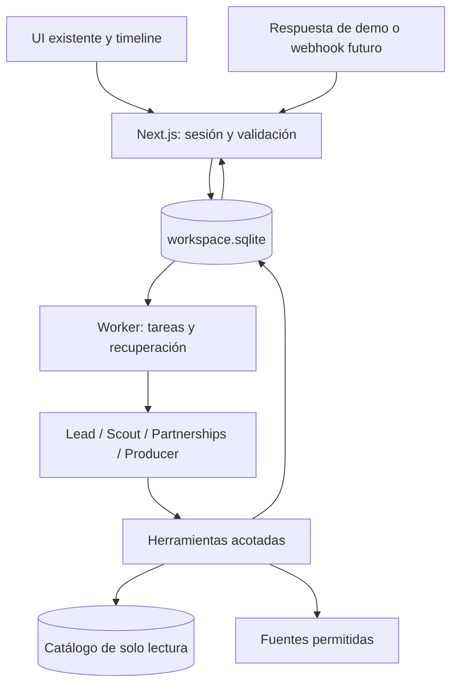

# Plan de implementación de agentes — Event GTM

Estado: propuesta, 28 de septiembre de 2026. Base: [revisión del backend](backend-review-20260928.md), [definición del producto](product-definition.md) y [brief](../HACKATHON_BUILD_BRIEF.md). Este archivo planifica el trabajo; los módulos descritos todavía no están implementados.

**Propuesta:** construir primero un ciclo completo con cuatro roles, tareas persistentes y una respuesta entrante que cambie el plan y el borrador. Mantener Next.js, el catálogo SQLite de solo lectura y el Event Studio existente. Añadir una segunda SQLite operacional y un worker Node independiente de las peticiones HTTP.

## Tiempo y alcance

Estimación de ingeniería, no garantía de duración. Supone una persona desarrollando con asistencia de IA, familiaridad con TypeScript, la UI actual reutilizable, acceso funcional a la API del modelo y ejecución en un host Node con disco persistente. Incluye integración y comprobaciones; no depende de que varios agentes de programación trabajen en paralelo.

| Entrega | Tiempo total desde el inicio | Qué incluye |
|---|---|---|
| Primer recorrido parcial | 2–4 horas | Brief guardado, consulta real del catálogo, primera tarea con modelo y resultado persistido; todavía no el ciclo completo |
| Demo integrada de agentes | 6–10 horas | Cuatro roles, timeline, borrador persistido, respuesta simulada etiquetada, cambio de plan y recuperación básica |
| P0 completo del producto | 2–4 jornadas de unas 8 horas, en total | Lo anterior más cuenta real, website con corrección/fallback, top 3 y estados del mapa, despliegue elegido y validación del recorrido completo |

Las cifras no se suman: son tiempos totales para cada alcance. Configuración de proveedores, páginas externas difíciles de leer, problemas de despliegue o cambios de alcance pueden ampliar el rango. Reestimar al completar el primer recorrido. La preparación para clientes reales requiere otra estimación tras decidir hosting, autenticación, carga y canales externos.

La demo integrada es un recorte explícito del P0: utiliza una sesión de demo y un workspace del equipo en un entorno controlado; no se presenta como un producto multiusuario con login terminado. El perfil se confirma manualmente. La respuesta del organizador se simula y se muestra como tal; las llamadas al modelo, herramientas, decisiones y escrituras son reales. No se simulan actividades de agentes en la timeline.

Si quedan menos de tres horas, priorizar un recorrido parcial visible con una oportunidad: investigar → proponer plan → guardar borrador. No prometer el ciclo completo de cuatro roles, recuperación y cambio por respuesta entrante dentro de ese plazo.

## Comportamiento que tiene que demostrar

1. El usuario ingresa su website, corrige un perfil propuesto y confirma resultado deseado, audiencia, mercado/fechas y presupuesto. Se distinguen datos atribuidos al website, inferencias del modelo y decisiones confirmadas por el usuario. Si la extracción falla, puede describir su empresa manualmente.
2. Scout recupera pocos eventos, revisa sus claims y consulta una fuente oficial de un candidato cuando es accesible. Si no logra verificarlo, conserva el estado pendiente.
3. Lead prioriza hasta tres oportunidades y decide si necesita verificación, aclaración del organizador o producción de un concepto.
4. Partnerships redacta una pregunta y deja visible la información pendiente. Producer prepara un concepto con audiencia, formato, agenda y supuestos separados de los hechos.
5. Se introduce una respuesta de demo: patrocinio de USD 5.000 para un presupuesto de USD 2.000; workshop disponible, precio todavía desconocido.
6. Partnerships interpreta la respuesta; Lead revisa su decisión y crea una tarea de actualización para Producer.
7. Se muestra un borrador actualizado con el costo pendiente. Se distingue claramente que es una propuesta privada y una respuesta simulada, no un mensaje enviado ni un evento publicado.
8. Tras recargar, cerrar sesión y volver, el usuario recupera brief, oportunidad, historial y borrador. Reiniciar el worker conserva las tareas y permite reanudar una que quedó reservada.

En el mapa, el color identifica estado: verde = evento próximo con fecha y ubicación verificadas; ámbar = falta un dato material; violeta = concepto propuesto por la empresa; azul = plan activo; gris = edición histórica. Cada estado también tiene texto. El tamaño comunica encaje relativo en la lista, nunca éxito o ROI. Eventos online quedan en la lista; centroides de ciudad se marcan aproximados y no como sedes. No inventar ni desplazar coordenadas; agrupar puntos densos.

El paquete local listo para Luma contiene nombre, descripción, audiencia, formato, agenda y CTA, además de fecha/hora/zona y lugar solo cuando estén confirmados. Incluye un brief privado con razón, supuestos de presupuesto, fuentes, cohosts potenciales y decisiones pendientes. Persiste las ediciones manuales. La UI ofrece preparar/exportar ese contenido y explicita que no se creó el evento en Luma.

La selección del siguiente trabajo la hace el Lead a partir del estado y la evidencia. El backend impone permisos, dependencias y límites. Una cadena fija de textos con nombres de roles no cumple este criterio.

El escenario de USD 5.000 es un fixture controlado del inbox de demo, etiquetado como simulado y unido al workspace/oportunidad correctos. Es entrada para que los agentes replanifiquen, no un claim confirmado en el catálogo. El usuario solo lo dispara desde la sesión de demo autorizada; las respuestas se pueden repetir para ensayar el recorrido.

## Roles y herramientas

| Rol | Responsabilidad | Herramientas disponibles | Resultado persistido |
|---|---|---|---|
| Lead + Strategist | Priorizar, elegir acción y asignar siguiente trabajo | `readBrief`, `readOpportunity`, `readTaskResults`, `createTask`, `proposePlan` | Decisión con versión de brief, fuentes, razones breves y siguientes tareas |
| Scout | Recuperar candidatos y verificar hechos | `searchCatalog`, `getEventEvidence`, `fetchAllowedSource`, `saveClaim`, `requestTask` | Candidatos y claims con URL, fecha, soporte e incertidumbre |
| Partnerships | Preparar preguntas e interpretar respuestas | `readContact`, `draftOutreach`, `readInboundReply`, `saveReplySummary`, `requestTask` | Mensaje propuesto y resumen con referencia a la respuesta original |
| Producer | Preparar y revisar concepto y brief de producción | `readPlan`, `readBrief`, `readClaims`, `proposeDraftRevision`, `requestTask` | Revisión del borrador vinculada al plan que la motivó |

Los cuatro roles comparten un adaptador de modelo y un ejecutor de herramientas; cambian instrucciones, contexto y permisos. La configuración del modelo se mantiene en servidor y se comprueba al inicio. Empezar con un modelo disponible para todos y optimizar por rol después de medir resultados.

Usar la API de Anthropic prevista en el producto, con llamadas a herramientas y contratos de salida validados. Su API devuelve llamadas estructuradas a funciones de la app; nuestro backend ejecuta las funciones autorizadas y devuelve los resultados al modelo. Un esquema válido no garantiza evidencia verdadera: verificar IDs, asociación con la oportunidad y versiones en código. [Documentación de herramientas](https://platform.claude.com/docs/en/agents-and-tools/tool-use/overview), [salidas estructuradas](https://platform.claude.com/docs/en/build-with-claude/structured-outputs).

## Arquitectura y contratos



- **Persistencia:** `web/.data/workspace.sqlite`, ignorada por Git, con ruta configurable. Catálogo y workspace tienen conexiones distintas. Migraciones versionadas, transacciones cortas, foreign keys y manejo acotado de contención entre API y worker.
- **Procesos:** Next.js sirve HTTP; `pnpm worker` consume tareas. Ambos se ejecutan en el mismo host con disco persistente para la demo. El worker no depende de que el navegador permanezca abierto.
- **Lecturas UI:** polling del estado del run y timeline cada pocos segundos mientras haya trabajo. Se puede pasar a SSE después sin cambiar el modelo de datos.
- **Recuperación:** reservas temporales de tareas, reclamación atómica, reintentos limitados y eventos de error. Nunca mantener una transacción durante una petición de red o al modelo.
- **Contexto:** recuperar como máximo un conjunto pequeño de candidatos y sus claims relevantes. No enviar el catálogo completo al modelo ni confundir coincidencia FTS con ajuste comercial.

Registros iniciales:

| Grupo | Contenido |
|---|---|
| Workspace y brief | Identidad/sesión de demo, workspace, perfil confirmado y versiones inmutables del brief; guardar origen de cada campo como website, inferencia o confirmación del usuario |
| Oportunidades y evidencia | ID de edición del catálogo, estado, acción propuesta y nuevos claims con procedencia |
| Runs y tareas | Rol, objetivo, dependencias, input refs/versiones, estado, intentos, reserva, resultado/error y clave de idempotencia |
| Eventos y decisiones | Acción realizada, brief/plan consumido, evidencia, razón breve y tareas derivadas |
| Mensajes | Conversación, contenido original, ID de entrega único y marca de simulación |
| Borradores | Revisiones, versión vigente, campos de Luma y brief privado, campos editados por usuario y referencia al plan |

Estados mínimos de tarea: `queued`, `running`, `waiting_input`, `waiting_approval`, `succeeded`, `failed`, `cancelled`. Registrar resultados obsoletos sin aplicarlos cuando cambia el brief o plan que consumieron.

La sesión resuelve el workspace en servidor; no aceptar un `workspace_id` arbitrario enviado por el modelo o cliente. Para el P0 completo, añadir usuarios y membresías autenticadas y probar aislamiento. La identidad de demo no se expone como login público.

La finalización de una tarea y la creación de su decisión, eventos y tareas siguientes son atómicas. La deduplicación se apoya en restricciones únicas por operación/versión o ID de entrega. Tras un fallo puede repetirse una llamada al modelo; lo que debe evitarse es aplicar dos veces su efecto. No prometer ejecución exactamente una vez.

Preservar cambios humanos del Studio: el agente propone una revisión y comprueba la versión antes de aplicarla. Ante conflicto, mostrar la propuesta para revisión en vez de sobrescribir la edición humana.

### API propuesta para la demo

| Ruta | Comportamiento |
|---|---|
| `GET /api/workspace` | Recupera perfil, oportunidades y borradores del workspace de la sesión |
| `POST /api/onboard` | Guarda website y perfil confirmado, con procedencia, preguntas de onboarding y fallback manual |
| `POST /api/briefs` | Valida y guarda una nueva versión del brief |
| `POST /api/runs` | Crea run y tarea inicial de forma durable; devuelve 202 e ID |
| `GET /api/runs/[id]` | Estado, tareas, timeline y referencias a resultados |
| `GET /api/opportunities/[id]` | Plan, personas, evidencia, actividad y borrador |
| `PATCH /api/drafts/[id]` | Guarda edición humana con versión esperada; 409 ante conflicto |
| `POST /api/inbound/reply` | Persiste una respuesta autorizada, deduplica y crea la tarea correspondiente |

Reutilizar los tres endpoints de catálogo. El cliente no necesita un endpoint público para ejecutar arbitrariamente tareas: el worker es quien las consume. Un reintento solicitado desde la UI debe validar sesión, ownership y estado.

## Etapas de implementación

Los rangos de esta tabla suman **6–10 horas** para la demo integrada.

| Etapa | Trabajo | Tiempo | Evidencia para darla por terminada |
|---|---|---|---|
| 1. Estado operacional | Migraciones, repositorio, sesión de demo, brief/versiones, oportunidad y borrador | 1–1,5 h | Crear y leer desde API; recargar conserva el brief; catálogo intacto |
| 2. Worker y runtime | Reclamación/reservas, recuperación, adaptador de modelo, validación, permisos y eventos | 1,5–2,5 h | Una tarea usa una herramienta real, guarda resultado y se recupera de un fallo controlado |
| 3. Cuatro roles | Herramientas del catálogo, lectura acotada de fuente, decisiones, outreach propuesto y generación de borrador | 1,5–2,5 h | Run real produce evidencia, decisión y borrador; el siguiente trabajo depende del resultado |
| 4. UI y respuesta | Onboarding y atribución de perfil, estados de mapa/lista, timeline, paquete Luma, respuesta simulada y replanteo | 1,5–2,5 h | Respuesta crea nuevas tareas y revisión visible; recarga no pierde perfil, timeline ni borrador |
| 5. Validación | Reintentos/duplicados, presupuesto cambiado, ediciones humanas, regresiones y ensayo de demo | 1–2 h | Recorrido verificable, repetible, con estados de error claros |

Con los refinamientos anteriores, las bandas por etapa suman aproximadamente **6,5–11 horas**. Se recomienda reservar **6–10 horas para la demo** como meta de alcance, reestimando al terminar el primer recorrido y recortando funciones opcionales si las etapas de integración o QA superan su rango. La estimación de la demo es deliberadamente distinta de tener el P0 multiusuario completo.

Primero fijar los contratos; luego las piezas de UI y backend pueden repartirse si hay más desarrolladores. No dividir el mismo repositorio de persistencia o el mismo componente entre implementadores simultáneos. No estimar que duplicar desarrolladores reduce el tiempo a la mitad: el worker, contratos e integración tienen dependencias.

### Archivos previstos

```text
web/lib/contracts/agents.ts
web/lib/contracts/workspace.ts
web/lib/server/workspace/migrations/
web/lib/server/workspace/repository.ts
web/lib/server/workspace/session.ts
web/lib/server/agents/model-client.ts
web/lib/server/agents/runtime.ts
web/lib/server/agents/dispatcher.ts
web/lib/server/agents/roles.ts
web/lib/server/agents/tools/
web/lib/server/demo/organizer-reply.ts
web/scripts/run-agent-worker.ts
web/app/api/{workspace,briefs,runs,opportunities,drafts,inbound}/...
web/components/agent-timeline.tsx
web/tests/workspace.test.ts
web/tests/agent-runtime.test.ts
web/tests/agent-replanning.test.ts
```

Adaptar `research-workspace.tsx` y `event-studio.tsx` para usar la nueva API. Extender la recuperación del catálogo con filtros geográficos explícitos sin modificar su archivo SQLite. Las ciudades solo conocidas por evidencia requieren una resolución trazable; no asumir que todos los registros tienen `city` completa.

Añadir a `.env.example` las variables para la ruta del workspace, modo de demo, modelo, credencial del proveedor y límites de ejecución, siempre sin valores secretos. La credencial nunca se envía al navegador. El modelo debe configurarse con un ID comprobado en la cuenta al implementar.

## Límites necesarios para que el ciclo sea confiable

- Establecer tope de llamadas, pasos, tiempo y reintentos por run; registrar uso real y validar el presupuesto antes de seguir creando trabajo.
- Validar argumentos y resultados; los roles no reciben SQL, shell o acceso arbitrario al filesystem.
- Tratar páginas y mensajes entrantes como datos, no como instrucciones para ampliar permisos. Limitar hosts, redirecciones, tamaño y tiempo de lectura. Si la fuente no es accesible, guardar el pendiente y continuar.
- Cada hecho requiere evidencia; las suposiciones del concepto se guardan por separado. Precio desconocido sigue siendo desconocido.
- Limitar el ciclo de tareas derivadas para que el Lead no genere trabajo sin fin. Si falta información, usar `waiting_input` con un motivo visible.
- Guardar mensajes propuestos, sin enviar ni publicar durante esta entrega. Al integrar acciones externas, implementar aprobación vinculada al contenido exacto y executor separado.
- Distinguir error de proveedor de resultado vacío. Sin credencial o ante fallo del modelo, mostrar error recuperable; no sustituirlo silenciosamente por una respuesta simulada.

## Criterios de aceptación y validación

- [ ] Los cuatro roles realizan trabajo mediante el runtime y herramientas autorizadas.
- [ ] Cada decisión referencia brief/plan y evidencia utilizados.
- [ ] El onboarding permite corregir campos extraídos, distinguir web/inferencia/confirmación y continuar con una descripción manual si no puede leer el website.
- [ ] Objetivo, audiencia, región/fechas y presupuesto confirmados llegan al plan; restricciones ausentes no se inventan.
- [ ] La lista superior muestra hasta tres oportunidades genuinas y cada razón de encaje enlaza evidencia. El mapa respeta la semántica de color/tamaño, deja online en lista y rotula ubicación aproximada.
- [ ] El presupuesto cambia la decisión cuando existe un costo conocido; el costo faltante queda pendiente.
- [ ] El mensaje de demo aparece como simulado, y genera una decisión y un borrador nuevos mediante llamadas reales.
- [ ] El mensaje solo se procesa por una conversación/workspace autorizados.
- [ ] Producer genera contenido usable para Luma y un brief privado; fecha, zona y lugar sin confirmar quedan vacíos o explícitamente propuestos.
- [ ] Reenviar el mismo ID de respuesta no duplica efectos.
- [ ] Reiniciar el worker conserva tareas y recupera una reserva vencida.
- [ ] Una respuesta tardía para un brief anterior no sobrescribe el plan vigente.
- [ ] Una revisión automática no pierde cambios humanos del borrador.
- [ ] Cerrar sesión y volver a entrar al mismo workspace conserva brief, oportunidades, actividad y borrador; otra membresía no puede leerlos.
- [ ] El catálogo permanece inmutable; las rutas nuevas respetan el workspace de la sesión.
- [ ] Pasan tests, typecheck, lint, build y smoke de navegador para las vistas modificadas.

Usar adaptador de modelo controlado en tests para probar decisiones de persistencia, fallos y reintentos sin costos ni aleatoriedad. Aparte, ejecutar al menos un recorrido real con el proveedor y conservar sus eventos de herramienta. No usar un test simulado como prueba de que el proveedor está integrado.

Para mostrar autonomía, ensayar dos respuestas: patrocinio conocido por encima del presupuesto y patrocinio conocido por debajo. El plan y/o siguiente tarea deben reflejar las alternativas y la evidencia disponible. Si ambas ejecuciones producen siempre la misma cadena sin atender al dato, revisar el rol del Lead.

## Extensión hasta el P0 completo

Después de la demo controlada, completar una cuenta real con membresías; onboarding desde website con extracción propuesta, corrección y alternativa manual; top 3 con filtros de ciudad/fecha/presupuesto y razones sustentadas; estados de oportunidad y los cinco colores sincronizados entre mapa/lista; despliegue Node supervisado con almacenamiento persistente; pruebas del recorrido al cerrar sesión y volver. Para este producto, esos puntos son parte del P0, no trabajo opcional que se pueda excluir del MVP: la demo recorta su implementación y debe quedar explícito.

Taste, Slack, envío real de email, creación externa en Luma, aprendizaje automático de preferencias y migración de plataforma quedan para una entrega posterior. No son necesarios para verificar que el equipo de agentes toma decisiones, coordina trabajo y conserva sus resultados.
