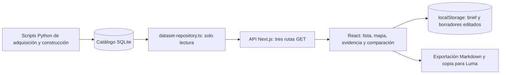
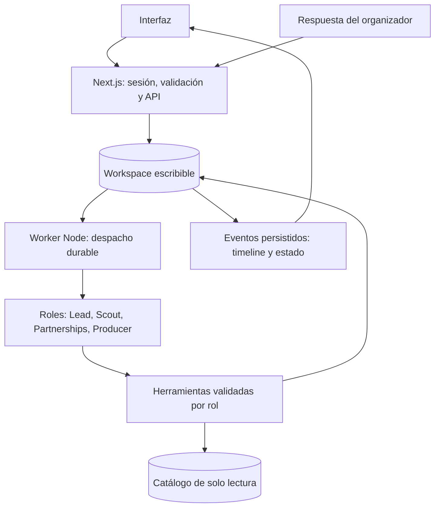

# Revisión de backend y agentes — 28 de septiembre de 2026

Revisión del checkout `4b9a25d`, contrastada con `AGENTS.md`, `README.md`, `product-definition.md` y `HACKATHON_BUILD_BRIEF.md`. Se inspeccionó código, se ejecutaron pruebas y se consultó la API local. Este documento describe el estado observado y propone trabajo; no implementa el backend pendiente.

**Dictamen:** hay una base funcional de consulta y evidencia. El backend del producto autónomo todavía falta. No encontré llamadas a modelos, herramientas de agentes, despacho de tareas ni persistencia operacional en `web/`. Los agentes mostrados en la interfaz son roles anunciados, todavía sin ejecución.

La definición encaja con **Autonomous Organizations**: la página oficial pide coordinación, asignación de trabajo, decisiones y ejecución mediante herramientas. Mi evaluación es que la demo actual aún no demuestra ese ciclo. El número de nombres de agentes no lo acredita. [Descripción oficial del track](https://luma.com/g42o84ln).

## Cómo funciona hoy

1. Los scripts de investigación prepararon el catálogo fuera del ciclo de peticiones de la app. Abrir la página no los ejecuta ni actualiza las fuentes.
2. React llama a `GET /api/events`. El repositorio normaliza filtros, consulta FTS5 y SQLite, calcula estados temporales y devuelve resultados paginados.
3. `GET /api/events/[id]` recupera evidencia, organizaciones, costos y ediciones relacionadas. `GET /api/health` consulta estadísticas del catálogo.
4. El brief se guarda en el navegador. Al aplicarlo, solo temas, país reconocido y fechas afectan la consulta. Audiencia, objetivo y presupuesto no intervienen en un ranking.
5. Event Studio construye un borrador con interpolación de strings y una agenda fija. Sus ediciones se guardan en `localStorage`; el botón para Luma copia texto al portapapeles.

Referencias: [repositorio SQLite](../web/lib/server/dataset-repository.ts), [rutas](../web/app/api/events/route.ts), [workspace](../web/components/research-workspace.tsx), [Event Studio](../web/components/event-studio.tsx).

**Distinción importante:** usar agentes para investigar o programar este repositorio no significa que los usuarios de la app tengan agentes trabajando para ellos. Ese segundo sistema debe existir en el runtime del producto.

## Estado frente al producto

| Capacidad | Estado observado | Consecuencia |
|---|---|---|
| Catálogo, búsqueda y evidencia | Implementado | Base reutilizable para herramientas del Scout |
| Perfil de empresa desde website | Falta | El website es un campo de texto; no hay extracción |
| Cuenta y workspace privado | Faltan | No hay sesión, membresía ni estado privado en el servidor |
| Top 3 personalizado | Falta | Hay resultados por fecha/relevancia textual y selección manual |
| Roles con herramientas y tareas | Faltan | Ningún agente puede asignar, consumir o reanudar trabajo |
| Respuesta entrante que cambia el plan | Falta | No hay endpoint, decisión versionada ni evento que reactive trabajo |
| Event Studio | Parcial | Preview, edición y copia existen; generación por agente y guardado en servidor faltan |
| Continuar entre visitas | Falta | No hay worker ni tareas persistidas |
| Envío o publicación aprobados | Faltan | La app no envía mensajes ni crea eventos externos |

El README y la definición de producto están atrasados respecto del Event Studio: ya no corresponde decir que no existe. Sí corresponde decir que es un editor local sin backend operacional. Las tablas `event_concepts` y `luma_drafts` del catálogo contienen ejemplos, pero la app no las usa como almacenamiento de usuarios; el catálogo sigue abierto en solo lectura.

## Hallazgos y prioridades

Los primeros puntos son brechas frente al P0; los últimos son problemas del backend existente.

**1. Prioridad P0: falta la fuente de verdad del workspace.** El brief se escribe en `localStorage` (`research-workspace.tsx:65–77`); el borrador también (`event-studio.tsx:47–54`); la selección vive en React (`research-workspace.tsx:46`). No se puede recuperar el trabajo mediante una cuenta, compartirlo entre dispositivos ni coordinar workers con ese estado. Crear una base operacional separada del catálogo y resolver el workspace desde una sesión validada. Un email escrito en un formulario no acredita identidad.

**2. Prioridad P0: falta el ciclo de agentes.** Solo hay tres rutas GET y ningún módulo de ejecución. La interfaz lo reconoce en `research-workspace.tsx:146`. La agenda y el texto inicial del Studio son una plantilla (`event-studio.tsx:11–24`). Hace falta un worker que consuma tareas persistidas, ejecute herramientas por rol y guarde resultados y eventos. Debe poder recuperarse de un reinicio; un callback en el navegador o una promesa lanzada sin esperar desde una ruta no cumple ese requisito.

**3. Prioridad P0: la búsqueda no aplica la intención comercial.** `applyBrief()` solo traduce temas, país y fechas (`research-workspace.tsx:119–123`). El contrato no tiene ciudad, objetivo, audiencia o presupuesto como filtros de búsqueda (`contracts/event-gtm.ts:85–94`). Los tokens FTS se unen con OR (`dataset-repository.ts:164–165`). Reproducción con reloj fijo `2026-09-28T12:00:00Z`: `AI infrastructure San Francisco` devuelve 30 resultados e incluye un evento de Singapur entre los primeros. Separar restricciones geográficas/temporales de texto y, después, evaluar un conjunto pequeño contra el brief. `score-utils.ts` solo tiene consumidores en tests; no existe una política de ranking conectada.

**4. Prioridad P0 para la demo: la evidencia comercial y geográfica es incompleta.** La SQLite contiene cuatro filas en `event_costs`, no cuatro precios para cada evento. PyBay 2026 tiene `city=null`, no tiene coordenadas ni costos en su expediente, aunque conserva 15 assertions. El precio desconocido debe producir una tarea de verificación, no un supuesto de gratuidad. Para demostrar SF y presupuesto conviene verificar pocos candidatos reales y guardar nuevos claims en el workspace, referenciando la edición original. El snapshot importado por sí solo no acredita una verificación actual en la web oficial.

**5. Prioridad P2: la caché de estadísticas pierde utilidad entre peticiones.** `getCatalogStats()` usa el timestamp ISO exacto como clave (`dataset-repository.ts:147–155`). Repetir el mismo reloj reutiliza el objeto; cambiarlo un segundo recalcula todo. Esas cinco recalculaciones tardaron aproximadamente 51–153 ms en esta máquina, como observación exploratoria, no benchmark de carga. Cada búsqueda pide esas estadísticas y usa SQLite síncrono. Separar totales estáticos de cifras temporales y definir caducidad explícita; no cachear indiscriminadamente por día, porque un inicio exacto puede cambiar de estado durante el día. Medir concurrencia antes de decidir si hay que aislar consultas costosas.

**6. Prioridad P2: los errores pierden su causa.** `connection()` convierte cualquier fallo de apertura/validación en un error genérico sin conservar la causa (`dataset-repository.ts:79`); las rutas devuelven errores sin registrarlos. Conservar mensajes públicos simples y agregar logs del servidor con request/run/task ID, fase y error. Esto será necesario para diferenciar una consulta fallida, un timeout de modelo y una salida inválida.

**7. Prioridad P2: se pierde el estado de fecha ambigua en el contrato público.** La clasificación interna distingue `date_ambiguous`, pero el resumen lo proyecta a `today` o `undated` (`dataset-repository.ts:124–129`). Upcoming e History excluyen esos registros. Mantener un estado explícito de fecha por verificar para que Scout pueda crear una tarea y el usuario no interprete una fecha conocida como inexistente.

## Qué conservar

- Apertura con `readOnly: true` y `PRAGMA query_only = ON`; la investigación queda protegida.
- SQL parametrizado, límites de paginación, tokenización que elimina sintaxis FTS del usuario y resolución de alias.
- Evidencia con IDs, fuente, fecha observada, clase y conflictos; no se inventan pagos por haber un sponsor listado.
- Reglas temporales conservadoras y reloj inyectable para pruebas.
- Separación entre repositorio del servidor y contratos de la API.
- Studio editable que identifica el evento como propuesta y dice que no publicó nada en Luma.

No hace falta reemplazar este catálogo para construir el producto. Sí hace falta añadir la capa operacional que describe el brief.

## Uso recomendado de agentes

Para este hackathon propongo **cuatro roles lógicos dentro de un mismo runtime**, fusionando GTM Lead y Strategist. No requieren cuatro servicios ni cuatro modelos diferentes. La API de Anthropic ya figura como opción en la definición; la decisión importante es el contrato de herramientas, estado y decisiones. La guía de Anthropic distingue workflows prefijados de agentes que deciden cómo actuar, y recomienda empezar con componentes simples y añadir complejidad cuando mejora resultados. [Building effective agents](https://www.anthropic.com/engineering/building-effective-agents).

| Rol propuesto | Decisión que aporta | Herramientas acotadas |
|---|---|---|
| Lead + Strategist | Qué oportunidad priorizar, qué falta investigar y qué tarea pedir después | Leer brief/resultados, proponer plan, crear tareas, solicitar aprobación |
| Scout | Qué fuente consultar y si un dato alcanza para sostener una afirmación | Buscar catálogo, leer expediente, consultar fuentes permitidas, guardar claims |
| Partnerships | Qué preguntar y cómo interpretar una respuesta | Leer contacto verificado, redactar mensaje, procesar respuesta, solicitar tareas |
| Producer | Cómo adaptar el concepto y borrador al plan vigente | Leer plan/brief, proponer revisión del borrador, guardar tareas de producción |

El despachador es código determinístico: reclama tareas listas y aplica permisos, dependencias, límites y reintentos. El Lead decide el siguiente trabajo a partir de los resultados. El backend valida esa decisión antes de persistirla. La autonomía se demuestra cuando cambia la secuencia o el plan por un resultado real, y queda registrada la relación entre ambas cosas.

SQL, filtros, autorizaciones, deduplicación, suma de costos conocidos y transiciones válidas deben seguir siendo código ordinario. El modelo aporta interpretación, investigación dirigida, priorización explicada y redacción. No es necesario convertir cada operación en un agente.

### Arquitectura mínima propuesta

Para una demo en un host Node con disco persistente, una segunda SQLite es una opción suficiente. Next.js y el worker pueden compartirla en ese host. El despliegue debe mantener vivo el worker y preservar el archivo; no asumir que el filesystem de cualquier entorno de hosting lo hace. Migrar a una base compartida si se necesitan varias réplicas o un entorno incompatible. Es una propuesta para esta demo, no una verificación de despliegue.

Registros mínimos: identidad/sesión y membresía, `workspaces`, `brief_versions`, `opportunities`, `agent_tasks`, `agent_events`, `decisions`, `outreach_threads`/mensajes, `approval_requests` y `event_drafts`. Las nuevas verificaciones necesitan claims propios con fuente y fecha. Referenciar IDs del catálogo sin modificarlo. Feedback y aprendizaje pueden esperar.

Además de los campos del brief, cada tarea necesita ID, dependencias, versión de entrada, número de intentos, vencimiento de reserva, clave de idempotencia y error. El worker reclama una tarea de forma atómica; no mantiene una transacción abierta durante una llamada al modelo. Si cae, otra ejecución recupera tareas cuya reserva venció. El esquema valida tanto argumentos de herramientas como resultados del modelo y comprueba que los IDs de evidencia pertenecen al contexto correcto.

Guardar resultados, decisión, eventos y siguientes tareas mediante transacciones. Aplicar límites de pasos, tiempo y uso del modelo; una tarea bloqueada debe decir qué dato o aprobación falta. La timeline muestra acciones y razones breves respaldadas por registros, sin inventar actividad ni exponer razonamiento interno del modelo.

Cada resultado debe indicar la versión del brief/plan que consumió. Si el usuario cambia el presupuesto durante una ejecución, ese resultado queda obsoleto y se replanifica; no debe sobrescribir el plan nuevo. Versionar también borradores para preservar cambios humanos.

Un mensaje entrante necesita un ID de entrega único y asociación validada con su conversación/workspace. Duplicar la entrega no debe crear tareas o borradores repetidos. Para un webhook real, validar autenticidad; para la demo, permitir un evento simulado desde una sesión autorizada y mostrar que es simulado.

La aprobación corresponde al destinatario, canal, cuenta y contenido exactos. Si cambian, se invalida. Las herramientas de investigación no reciben credenciales de envío. Cuando se implemente lectura de websites, tratar su contenido como datos no confiables y controlar destinos/redirecciones para evitar acceso a redes internas.

### Orden para terminar un ciclo demostrable

1. Persistir workspace, brief, oportunidad y borrador; establecer sesión y alcance de acceso. Recuperarlos desde la UI al recargar.
2. Añadir tareas/eventos y worker reanudable. Primero probar ejecución, fallo y recuperación con herramientas controladas.
3. Conectar los cuatro roles al mismo runtime, validando sus outputs y límites de herramientas. Usar pocos candidatos con evidencia suficiente.
4. Conectar timeline y Event Studio a los registros reales. La vista previa existente se puede conservar.
5. Implementar respuesta entrante y revisión del plan/borrador; comprobar duplicados y resultados obsoletos.
6. Completar la entrada por website y el top 3 con restricciones explícitas. La selección de proveedores y la extracción deben admitir corrección del usuario.

La sesión y la persistencia forman parte del P0. Si durante desarrollo se usa una identidad de demo, debe declararse y no presentarse como login seguro terminado. Taste, Slack, publicación externa y un Learning Agent pueden esperar al ciclo principal.

**Prueba decisiva:** brief con presupuesto de USD 2.000 → Scout reúne evidencia → Lead pide aclaración → respuesta indica patrocinio de USD 5.000 y posibilidad de workshop → Partnerships extrae ambos datos con procedencia → Lead encarga a Producer revisar la propuesta → draft nuevo y decisión quedan guardados. La disponibilidad de un workshop no demuestra que su costo encaje: ese dato sigue pendiente hasta verificarse. Recargar y reiniciar el worker debe conservar todo; repetir la misma respuesta no debe duplicarlo.

También verificar: aislamiento entre dos workspaces, caída y reintento del worker, cambio de presupuesto durante un run, rechazo de una salida con evidencia inventada, ausencia de envíos sin aprobación y conservación de ediciones humanas del borrador.

## Verificación realizada y límites

| Comprobación | Resultado |
|---|---|
| `pnpm test` | 17/17 pasan, incluida comprobación de tamaño/mtime del catálogo |
| `pnpm typecheck` | Pasa |
| `pnpm lint` | Pasa |
| `GET /api/health` en `localhost:3010` | 200; 21.747 canónicas, 258 futuras, 453 relaciones sponsor, 276 empresas |
| `GET /api/events?pageSize=3` | 200; 3 resultados de 255 tech futuros |
| Detalle de PyBay 2026 | 200; 15 assertions |
| ID inexistente | 404 JSON |
| `GET /api/onboard` y `/api/drafts` | 404; la inspección de rutas confirma que no hay handlers de escritura |
| SQLite consultada en solo lectura | 21.749 filas físicas, 21.747 canónicas y 4 registros de costos |

Las comprobaciones directas de búsqueda usan el reloj fijo indicado; los conteos de futuros dependen del instante. Las pruebas actuales verifican el catálogo y helpers, no un sistema de agentes. No se hizo una prueba de carga, un build de producción ni una nueva prueba visual del navegador. Se utilizó el servidor local ya activo. No se modificó código de la app ni el catálogo.

Nota documental: el informe de investigación `reports/arquitectura-recomendada.md` describe PostgreSQL, pg-boss y componentes del proyecto de origen. Esos módulos no están en este checkout; `docs/growthx-reuse.md:5` confirma que no se trasladaron. No deben contarse como backend implementado de esta app.
