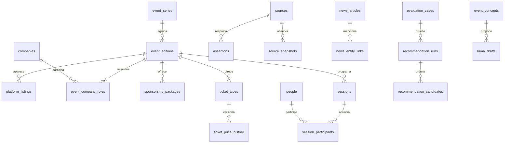

# Event GTM — investigación y dataset

**688 ediciones: 650 históricas y 38 futuras/actuales; 101 series; 288 organizaciones/marcas; 320 relaciones con rol sponsor explícito, más 21 ambiguas sponsor/partner; 10 artículos originales; 72 países/territorios identificados; 160 URLs de fuentes registradas.** Ventana histórica: 28 septiembre 2021 a 28 septiembre 2026, final exclusivo. Futuro observado hasta noviembre 2027. Geografía y cliente inicial siguen pendientes de decisión.

Título/fecha inicial: 100%; lugar textual: 97,67%; país: 81,54%; zona horaria: 28,63%; evidencia de sponsor: 2,33% de ediciones. No hay coordenadas geocodificadas ni ROI comercial verificado. Ocho núcleos son provisionales o secundarios; 652 proceden de calendarios, sin revisión individual del organizador. Estos números describen la muestra, **no cobertura mundial**. Los conteos exactos y todas las tablas están en `run_manifest.json` y `coverage.csv`.

**Recomendación: acotar y validar con un servicio asistido antes de construir el producto completo.** Hay hechos útiles y trazabilidad; no se ha demostrado superioridad de recomendaciones, demanda ni una ventaja extraordinaria. No se construyó/desplegó una app, publicó en Luma, contactó sponsors ni compró datos.

## Lectura y archivos

- [Fase 1: investigación y decisión](phase1-research.md), [competencia y plataformas prioritarias](phase1-market-access.md), [inventario complementario](phase1-source-inventory.md), [lote cultural/deportivo](notes/phase1-nontech.md).
- [Fase 2: arquitectura y recuperación](phase2-architecture.md), [fuentes de recuperación](phase2-retrieval-research.md), [costos por escenario](phase2-economics.md), [precios y permisos](phase2-cost-sources.md).
- [Validación y benchmarks](validation_report.md), [calidad](quality_report.md), [cobertura CSV](coverage.csv), [diccionario CSV](data_dictionary.csv), [continuación](next_steps.md).
- [Ejemplos de oportunidades, sponsors y Luma](examples/product-walkthroughs.md), [direcciones mapeables CSV](examples/map-opportunities.csv), [GeoJSON con geometría pendiente](examples/map-opportunities.geojson).
- [Base SQLite](dataset.sqlite), [manifiesto](run_manifest.json), [contrato original completo](spec/prompt-maestro.md).
- `data/observed/`: hechos publicados, fuentes y registros de adquisición; incluye estados de certeza y campos derivados identificados en assertions.
- `data/derived/`: clasificaciones, presencia repetida y pruebas funcionales con método. `data/proposals/`: concepto y borrador hipotéticos locales. `data/private-schemas/`: esquemas vacíos; no clientes inventados.
- `notes/`: evidencia permitida — metadatos, URLs, hechos/paráfrasis, registros y curación. Sin copias masivas de páginas, PDFs de terceros, invitados privados o credenciales.

Los 66 CSV representan el contrato lógico solicitado; [equivalencia a las 23 tablas físicas propuestas](phase2/logical-to-physical.csv) y DDL de diseño están en `phase2/`. una tabla vacía conserva cabeceras y motivo en el manifiesto. No se rellenan métricas, presupuestos o perfiles desconocidos para aparentar completitud. SQLite usa TEXT para intercambio y conserva JSON válido en columnas `_json`; las claves se verifican por script. El esquema físico recomendado se explica por separado en Fase 2.

## Reproducir sin red

Desde esta carpeta:

```sh
python3 scripts/build_dataset.py
python3 scripts/quality.py
```

Requiere Python 3.9+ y biblioteca estándar para construir/validar. Los resultados de tiempos pueden cambiar entre ejecuciones; IDs y hechos de entrada permanecen estables. `scripts/acquire.py` y `scripts/enrich.py` son adquisición **con red**, requieren `requests` y `beautifulsoup4`; una nueva ejecución observa el contenido de ese momento, no recrea una captura pasada. Respetar condiciones y permisos de cada fuente antes de reutilizarlos. No hacen bypass de bloqueos ni usan credenciales privadas.

```sql
-- Presencia explícita por edición; no implica contrato, gasto ni interés actual.
SELECT c.name, e.title, e.start_date, r.level, s.url
FROM event_company_roles r
JOIN companies c ON c.id = r.company_id
JOIN event_editions e ON e.id = r.event_id
JOIN sources s ON s.id = r.source_id
WHERE r.role = 'sponsor'
ORDER BY c.name, e.start_date;

-- Evidencia por campo y versiones: no basta con mirar la fila canónica.
SELECT field, value_json, locator, evidence_class, confidence_basis, s.url
FROM assertions a JOIN sources s ON s.id = a.source_id
WHERE a.entity_table = 'event_editions'
  AND a.entity_id = (SELECT id FROM event_editions WHERE title = 'PyCon ES 2024');
```

## Relaciones y semántica



`assertions.entity_table/entity_id` y `news_entity_links` son relaciones polimórficas verificadas. NULL significa desconocido/no obtenido, no ausencia. Sponsor, exhibitor, community, partner, organizer y speaker son roles distintos. Las 127 parejas de presencia repetida no son 127 renovaciones contractuales. Las noticias del organizador no constituyen corroboración independiente. Una página retirada no prueba cancelación.

## Derechos, costes y límites

No se presume licencia comercial por acceso público. El paquete conserva hechos y resúmenes propios para investigación; fuentes y condiciones siguen enlazadas. Antes de un producto redistribuible, resolver permiso y retención por fuente, en particular plataformas con restricciones. Cero compras en esta ejecución; coste del agente/herramientas y tiempo humano facturable no observables. Las estimaciones futuras no son costes medidos.

La deduplicación de calendarios usa UID; series inferidas requieren revisión y las marcas no equivalen a entidades legales. Los porcentajes de cobertura sólo usan el corpus como denominador. No existen etiquetas humanas de relevancia ni capturas previas al corte para backtest. `qa-results.json` verifica integridad, no la hipótesis de negocio.
