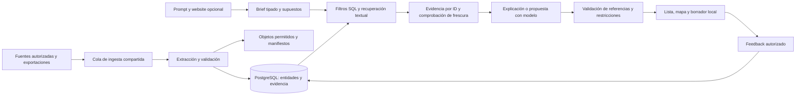

# Fase 2 — arquitectura, recuperación y economía del Event GTM

Fecha: **28 de septiembre de 2026**. Comenzó después del checkpoint de Fase 1, conservado en `phase1-checkpoint.json`. Investigación y diseño: **no aplicación, despliegue, migración ni integración autenticada ejecutados**. Las correcciones posteriores de QA quedan documentadas sin convertirlas en nueva adquisición.

**Recomendación:** mantener una base relacional, un worker con trabajos persistentes y un flujo determinista que use un modelo sólo en pasos acotados. Recuperar candidatos por filtros y texto, ampliar evidencia por ID y generar una explicación pequeña con referencias. No cargar todo el histórico en cada prompt ni adoptar ahora una base vectorial independiente, GraphRAG o un equipo de agentes por consulta. La complejidad debe ganarse con una mejora medida.

El [ADR vigente del repositorio](../growth-atlas-agent-architecture.md) es un antecedente de investigación; la decisión local efectiva está en [ADR 0001](../../adr/0001-arquitectura-agente-growth-atlas.md), que conserva TypeScript/Next.js, worker Node, PostgreSQL y pg-boss, con adaptador de modelos. Esta investigación **no cambia ese ADR ni migra el proveedor actual**. Los precios OpenAI de este estudio sirven para un escenario comparativo, no prueban que convenga sustituir otro modelo sin evaluarlo.

## 1. Qué aprendimos del corpus que afecta al diseño

| Observación real | Consecuencia propuesta |
|---|---|
|688 ediciones y 21.570 afirmaciones; 652 núcleos de dos feeds|Ingesta compartida y versionada, separada de la consulta de cada cliente. La repetición de búsquedas no sustituye un catálogo actualizado.|
|Fecha final incorrecta derivada del iCal de PyConES 2024|Guardar valor original, semántica de fecha y assertion preferida; una fila canónica no puede borrar el conflicto.|
|Una URL puede abrirse, pero cierto pasaje seguir sólo indexado|La calidad y el acceso pertenecen a la **afirmación**, además de a la fuente.|
|320 roles sponsor, 21 roles ambiguos; gasto/interés desconocidos|Roles tipados y estados separados. No convertir similitud en presupuesto o propensión calibrada.|
|Sólo tres direcciones normalizadas y cero coordenadas|Mapa progresivo; lista útil incluso sin puntos. El precio de un mapa no resuelve geocodificación ni derechos.|
|Cambios EdgeDB/Gel y CCR/Motiva; cierre de Gel|Identidad temporal y señales actuales antes de usar historia comercial. No fusionar institutos, filiales o sucesores por nombre parecido.|
|319 roles sponsor pasados en 60 meses frente a uno en los 12 recientes|Sesgo de extracción: mantener histórico, pero no atribuirle superioridad predictiva.|
|Ninguna etiqueta humana ni captura anterior al corte|Evaluación funcional hoy; backtest comercial todavía no defendible.|

## 2. Flujo mínimo y límites de responsabilidad

La ingesta produce hechos reutilizables; el flujo interactivo selecciona y explica. Una carencia importante genera un job de enriquecimiento con presupuesto, no una investigación global ilimitada. Mostrar una primera respuesta condicionada y completar en segundo plano cuando proceda. Objetivo de diseño, **no SLA medido**: lista almacenada en segundos; investigación adicional con progreso explícito y resultado persistente.

Estado propuesto: `queued → fetching → extracting → validating → ready`, con `retry`, `needs_review`, `blocked_access`, `failed` y `cancelled`. Clave idempotente por fuente/versión/extractor; arrendamiento y heartbeat del worker; transacción al guardar hechos y cursor. Reintentos acotados con espera documentada por proveedor, cierre ante permiso/credencial/CAPTCHA. Una escritura externa exige una acción autorizada distinta y comprobación de idempotencia; un reintento no puede duplicar eventos Luma.

Las operaciones ofrecidas al modelo deben ser pequeñas: `find_candidates(filters)`, `get_evidence(ids,fields)`, `get_company_history(id,cutoff)`, `request_refresh(ids,reason,budget)` y `prepare_local_draft(brief,evidence)`. El servidor impone tenant, permisos, límites, consultas parametrizadas y campos. No dar SQL libre, credenciales ni capacidad de enviar invitaciones dentro del flujo de investigación. Tratar texto de webs como datos: instrucciones incrustadas nunca pueden cambiar herramientas o presupuesto. La lectura de URLs aportadas requiere controles de destino/redirección para evitar acceso a recursos internos.

## 3. De 66 contratos lógicos a 23 tablas físicas propuestas

Se entrega [mapeo completo de las 66 tablas](phase2/logical-to-physical.csv) y [DDL de diseño](phase2/physical-schema.sql). **No es una migración aplicada ni un esquema certificado para producción.** La comprobación de mapeo cubre 66/66; PostgreSQL no se ejecutó en este research. Los CSV y SQLite originales mantienen intacto el contrato lógico.

Las 23 tablas se agrupan así:

- `entities` conserva identidades de empresa, persona profesional, serie, recinto, comunidad, sesión y noticia; `event_editions` añade fechas, ubicación y estados tipados que se filtran continuamente. `profiles` conserva versiones de perfiles; `entity_aliases` y `external_ids` separan nombre e identidad de plataforma.
- `sources`, `source_snapshots` y `assertions` representan evidencia. `changes` guarda versiones y conflictos. Una afirmación lleva valor JSON, fuente, localizador, clase, acceso de ese pasaje, vigencia y observación.
- `relations`, `measurements`, `offers`, `offer_versions` y `deadlines` agrupan relaciones, métricas y ofertas. Unidades, denominadores, monedas, estado previsto/reportado y vigencia no quedan enterrados en prosa.
- `jobs` y `job_steps` guardan adquisición, cursor, reintentos, costes y errores; `search_documents` es una proyección regenerable para búsqueda.
- `scopes`, `briefs`, `runs`, `candidates`, `artifacts` y `feedback` separan catálogo público y trabajo privado. Los conceptos y borradores son artifacts, nunca ediciones existentes hasta una acción explícita posterior.

El almacenamiento flexible usa JSONB con esquema por `kind`, no un documento gigante ni un EAV sin validación. Campos que deciden elegibilidad son columnas tipadas. PostgreSQL documenta indexación de JSONB, pero éste no conserva todos los detalles textuales del original; el hash y el objeto permitido viven aparte. [JSONB oficial](https://www.postgresql.org/docs/current/datatype-json.html).

Las claves compuestas `(scope_id,id)` evitan referencias accidentales entre ámbitos en las tablas principales. La propuesta incluye RLS, pero requiere roles/grants, autenticación confiable, políticas del catálogo y pruebas adversarias antes de producción. Arrays de evidence IDs y referencias JSON necesitan validación transaccional adicional; no se finge que PostgreSQL los comprueba como FK normales. Un artifact también se registra como entidad si recibe assertions por campo. Los adaptadores de exportación preservarán IDs lógicos y valores originales; todavía no están implementados. [Row security](https://www.postgresql.org/docs/current/ddl-rowsecurity.html).

Índices iniciales: país+fecha+estado; entidad+campo+observación para assertions; extremos+tipo de relación; entidad+métrica+periodo; GIN textual; jobs pendientes por fecha. Evitar indexar indiscriminadamente cada JSONB. Medir planes antes de particionar. La documentación recomienda GIN para FTS; no demuestra su rendimiento en nuestro servicio. [Índices FTS](https://www.postgresql.org/docs/current/textsearch-indexes.html).

## 4. Recuperación, contexto y calidad

Primero aplicar permiso, fecha, estado, modalidad y geografía; presupuesto duro requiere coste total conocido y moneda comparable. NULL no pasa como barato. Ubicación aproximada no habilita una distancia exacta. Después recuperar por texto y alias/taxonomía dentro del universo elegible; ampliar a las relaciones y fuentes necesarias para la decisión. El algoritmo ordena con componentes legibles; el modelo explica, no inventa puntuaciones a partir de intuición.

El paquete de evidencia incluye brief/versiones, IDs de candidatos, hechos elegidos, fuentes/localizadores, contradicciones, faltantes, fecha de corte y estado de frescura. La salida exige IDs incluidos en ese paquete; una cita desconocida o un precio sin assertion produce rechazo/revisión. Datos suministrados por el cliente y propuestas llevan un origen diferente. Structured Outputs ayuda al formato, pero no certifica hechos: manejar también rechazo, respuesta incompleta, referencias inexistentes y contradicciones. [Structured Outputs](https://developers.openai.com/api/docs/guides/structured-outputs).

**Búsqueda semántica:** propuesta opcional. Probar embeddings cuando los nombres/sinónimos/idiomas superen FTS; combinar listas por RRF o reranking evaluado, sin sumar cosenos y afinidades de escalas distintas. Primero vector exacto dentro del filtro; ANN puede filtrar después y omitir candidatos. Si se adopta, comparar recall con búsqueda exacta y filtros reales. No se generó ningún embedding. [pgvector](https://github.com/pgvector/pgvector), [estudio de alternativas](phase2-retrieval-research.md).

**Grafo y analítica:** las relaciones ya están explícitas y un join de pocos saltos basta como baseline. GraphRAG puede estudiarse para preguntas globales sobre muchos relatos, pero añade indexación y resúmenes generados que también deben actualizarse. DuckDB/Parquet sirve para snapshots y análisis de cohortes; no necesitamos otro servicio editable como segundo origen de verdad. Se investigaron estas alternativas, no se desplegaron. [Comparación y fuentes primarias](phase2-retrieval-research.md).

## 5. Mediciones reales, separadas de extrapolaciones

[Resultados reproducibles](phase2/retrieval-benchmark.json), [script](scripts/retrieval_benchmark.py), [paquete de ejemplo](phase2/evidence-packet-example.json). Equipo Darwin/arm64, Python 3.9.6 y SQLite 3.51.0. Cinco warmups y 200 muestras por consulta; corpus pequeño, local y caliente. Los tiempos cambian al repetir.

| Consulta | Filas | Mediana observada aproximada | p95 aproximado |
|---|---:|---:|---:|
|Filtrar futuro hasta marzo 2027|31|0,018 ms|0,021 ms|
|Tres campos de evidencia para diez eventos|32|0,044 ms|0,046 ms|
|Agrupar sponsors PyCon US por ediciones|186 organizaciones|0,240 ms|0,308 ms|

Se probó SQLite FTS5 con tres consultas, sin embeddings ni resultados humanos. **No son latencias de PostgreSQL, nube, carga concurrente, modelo o flujo completo.** Sirven para mostrar que contar/unir este corpus no exige por sí mismo un modelo ni un motor de grafos.

Serializar todos los eventos y assertions produjo **12,7 MB** frente a **11,4 kB** de un paquete limitado a diez eventos y tres campos (unos 1.115× menos bytes en este ejemplo). Los tokens se estimaron por caracteres/4: no son conteo de tokenizer ni facturación. El paquete pequeño omite mucha información y no demuestra calidad equivalente; deberá crecer según la pregunta. No presentar esa reducción como ahorro medido de LLM ni asumir que el corpus completo cabe en contexto sin contar tokens.

## 6. Modelos, rutas y caché

Propuesta de ensayo: parser determinista para iCal/precios/tablas; modelo eficiente para extracción textual estructurada; modelo de razonamiento para síntesis de pocos candidatos; escalado excepcional cuando haya conflicto o insuficiencia verificada. La guía oficial distingue Luna para trabajo repetible, Sol para razonamiento exigente y Astra para capacidad máxima. Es una hipótesis de selección; no se midió calidad en estas tareas ni acceso de la cuenta. [Guía oficial](https://developers.openai.com/api/docs/guides/latest-model).

No hacer un agente por fila, una llamada por assertion ni reextraer la web de empresa cada semana. Agrupar trabajos independientes, limitar entradas/salidas y pedir sólo campos que afectan a la decisión. No enviar todo el historial conversacional del cliente cuando basta el brief versionado. El batch puede reducir coste para trabajo no interactivo con una ventana de hasta 24 horas; no sirve para prometer una respuesta inmediata. [Batch](https://developers.openai.com/api/docs/guides/batch).

Tres cachés distintas: HTTP permitido por fuente; resultados de extracción por hash+versión; resultados de consulta por tenant+brief+permisos+versiones+frescura. Una caché de modelo es adicional: en GPT-5.6 y posteriores, la documentación actual exige un prefijo elegible mínimo de 1.024 tokens, cobra escritura a 1,25× y lectura a 0,1× del input normal. No asumir hits entre ejecuciones diarias; medir `cached_tokens` y `cache_write_tokens`. [Prompt caching](https://developers.openai.com/api/docs/guides/prompt-caching).

La retención del proveedor es distinta de nuestra política: Responses conserva estado por defecto durante 30 días; `store:false` no equivale por sí solo a Zero Data Retention para todos los registros/herramientas. Antes de usar datos privados, verificar el contrato y cada endpoint; conservar lo mínimo necesario. [Controles de datos](https://developers.openai.com/api/docs/guides/your-data).

## 7. Actualización y operación

Frecuencias propuestas, por validar con cambios reales: fecha/sede/cancelación/registro diariamente dentro de los próximos 14 días; semanalmente entre 15 y 90 días; mensualmente más lejos. Antes de recomendar compra o patrocinio, revalidar precio, disponibilidad, fecha y exclusividad. Calendarios históricos estables trimestralmente o por enlace cambiado; anuncios actuales de la empresa semanalmente mientras figure en una shortlist activa. El histórico de sponsor no caduca como hecho del pasado, pero no confirma actividad empresarial hoy.

Un cambio semántico invalida sólo entidades, índices y recomendaciones dependientes; hash idéntico evita reextracción. Borrado/retirada conserva una marca cuando el permiso lo permita y propaga borrado a derivados cuando corresponda. No inferir cancelación por404. Controlar tasa por host, permisos por fuente y cola de revisión de conflictos; dar prioridad a campos que cambian una decisión sobre la amplitud indiscriminada.

Métricas operativas propuestas: coste por fuente y edición nueva útil, repetidos, errores por campo, frescura de los candidatos mostrados, violaciones duras, evidencia no respaldada, tokens por paso, caché efectiva, reintentos, minutos humanos y resultado aceptado. Guardar modelo/precio/versión usados para que una tarifa nueva no reescriba costes pasados.

## 8. Decisión técnica y siguiente experimento

Mantener el diseño relacional existente y añadir sólo proyecciones/evidencia que el próximo caso real necesite. Prioridad: un lote futuro revalidado, brief consentido, comparación ciega y un flujo local trazable. Después evaluar FTS frente a híbrido en los fallos observados; aceptar una capa sólo si mejora resultados humanos y mantiene coste/frescura. Postergar ANN, grafo dedicado, aprendizaje automático de propensión y publicación Luma hasta contar con necesidad y datos.

Los [costes calculados](phase2-economics.md) indican que modelos/almacenamiento pueden ser pequeños frente a revisión humana y licencias. La arquitectura evita trabajo repetido; **no resuelve permisos, falta de datos o demanda comercial**. Las dos fases convergen en probar un servicio acotado y medir decisiones útiles antes de construir la plataforma completa.
