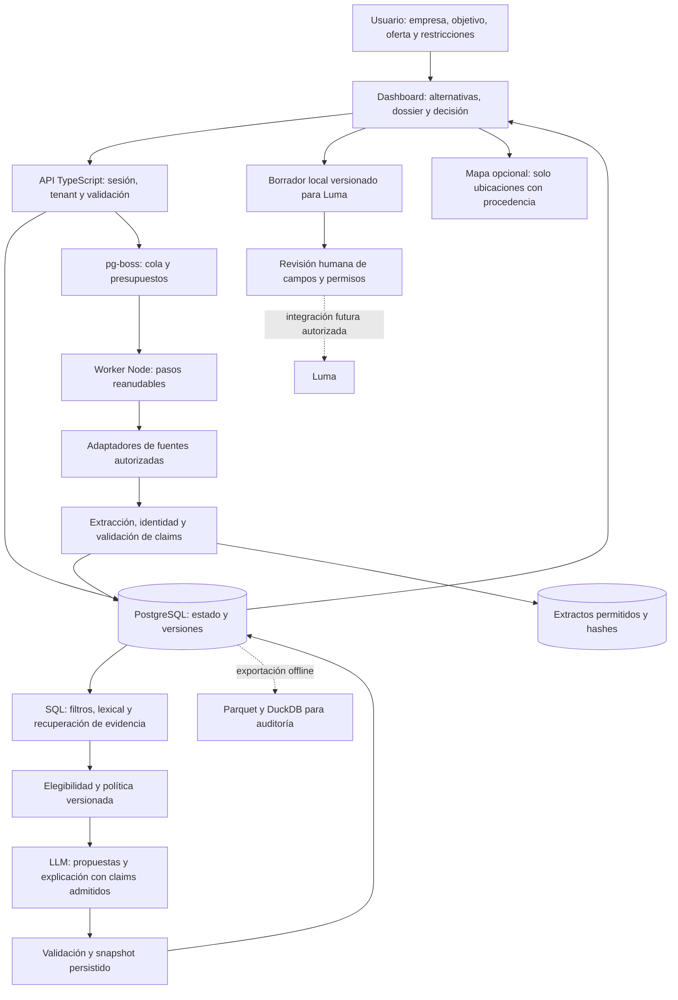

# Arquitectura recomendada después de la adquisición

Fecha: 28/09/2026. **Recomendación:** conservar el monolito modular TypeScript, PostgreSQL y el worker durable del repositorio. Ampliarlo como expediente de investigación y decisión, con adquisición incremental fuera de la consulta. Empezar con un comprador y una decisión próxima. El mapa es una vista secundaria; el primer entregable ejecutable es un contenido local para Luma que una persona completa y revisa.

Esta recomendación se apoya en el [dataset](../README.md), la [validación](../validation_report.md) y la lectura estática del código actual. No es una implementación ni una autorización para ampliar el producto. La geografía y el segmento comercial del nuevo estudio siguen abiertos. El alcance SF del código existente no limita retrospectivamente la adquisición internacional.

## Qué cambia al mirar los datos

**Hechos de esta ejecución:** hay ediciones, actores con diferentes roles, paquetes publicados, fechas parciales, contadores de plataforma, resultados autorreportados y publicaciones que comparten origen. Hay pocos costos comparables y ningún conjunto de resultados privados de clientes. No hay etiquetas humanas de recomendaciones útiles.

**Inferencia:** el problema principal no es elegir un framework de agentes. Es conservar identidad de edición, significado de cada métrica, permisos de datos y diferencias entre lo conocido, lo supuesto y lo pendiente. Más agentes no completan los importes que una fuente no publica. Un modelo tampoco vuelve independientes dos notas procedentes del mismo comunicado.

**Recomendación:** una respuesta debe contener alternativas y condiciones, junto con la evidencia necesaria para aceptarlas o descartarlas. “No podemos confirmar una opción” es un resultado válido. La similitud de una empresa con sponsors pasados no demuestra interés comercial actual.

## Auditoría del repositorio: conservar lo que ya avanzó

La base consultada es el commit registrado en `run_manifest.json`; no se corrieron tests ni se verificó un despliegue durante este research. Las observaciones siguientes son de código/documentación, no una certificación operacional.

| Área | Hecho encontrado | Decisión propuesta |
|---|---|---|
| Persistencia | El proyecto ya tiene runs, steps, snapshots, decisiones y contratos versionados sobre PostgreSQL. [Arquitectura del repo](../../../architecture.md). | Conservar. Sería incorrecto seguir describiéndolo como un buscador amnésico con cachés de seis horas. |
| Worker | `run-worker.ts` reanuda pasos y lee catálogo persistido; publica el resultado desde la base. [Código](../../../../frontend/lib/server/evaluations/run-worker.ts). | Extender pasos por fuente y checkpoint, sin rehacer cada investigación al consultar. |
| Scoring | `approvedPolicyFor()` devuelve `null`: no hay política comercial aprobada. [Código](../../../../frontend/lib/server/evaluations/scoring-policy.ts). | Mantener elegibilidad y comparación factual; no presentar prioridad de investigación como probabilidad de retorno. |
| Modelo | El adaptador usa Gemini directo tras el snapshot; valida IDs de claims y reconstruye resumen factual. La narrativa no modifica el orden oficial. [Código](../../../../frontend/lib/server/evaluations/model-adapter.ts). | Conservar el límite de autoridad. Elegir modelos por evaluaciones y costo del trabajo, no por novedad. |
| Fuentes | Hay lectura nativa limitada y descubrimiento Exa; Apify es una vía opcional con presupuesto y estados de ejecución. [Arquitectura](../../../architecture.md). | Adaptadores intercambiables; evitar que una URL descubierta se convierta automáticamente en claim admitido. |
| Aislamiento | Sesión opaca, membresía y tenant resueltos en servidor; roles y RLS documentados. | Reusar también en archivos, jobs, cachés y trazas. La información privada de sponsors/clientes no se mezcla con el corpus público. |
| Identidad Luma | El adaptador puede recuperar una edición por URL canónica sin discriminar año. [Código](../../../../frontend/lib/server/catalog/luma-adapter.ts). | Corregir antes de backfill: este lote contiene actividades diferentes que comparten un enlace. URL no equivale a edición. |
| UI | Dashboard, dossier, decisión y mapa opcional ya existen. | Preservar el recorrido. Agregar historial y pendientes donde ayudan a decidir, sin volver a una portada de mapa mundial. |

Las [limitaciones conocidas](../../../known-limitations.md) incluyen formularios de costos y selección de claims de ubicación, entre otras. No se declararon reparadas ni se reejecutaron sus pruebas. Los defectos de v0 que motivaron el ADR son historia del proyecto; deben contrastarse con la versión actual antes de convertirse otra vez en tickets.

## Componentes y límites



PostgreSQL es la fuente operacional de verdad. El almacenamiento de objetos conserva únicamente materiales que se pueden retener, referenciados por hash y política. SQLite/CSV son **entregables del research**, no una migración propuesta para sustituir Postgres. Parquet/DuckDB sirven para análisis de lotes y evaluación offline, cuando el volumen lo requiera. Las capacidades y condiciones de infraestructura están en [el estudio oficial de infraestructura](infraestructura-mapas-costos.md).

No hace falta desplegar 66 tablas físicas por tener 66 tablas lógicas de exportación. Tampoco hace falta una base de grafos para consultar empresa → rol → edición → serie. Un esquema relacional con índices resuelve esos recorridos iniciales; se reconsidera solamente ante una carga medida que no pueda cumplir el objetivo de latencia.

## Una ejecución completa

```mermaid
sequenceDiagram
    actor Persona
    participant App
    participant DB as PostgreSQL
    participant Worker
    participant Fuente
    participant Modelo
    Persona->>App: Describe empresa y decisión; aporta website
    App->>DB: Guarda brief versionado e idempotencia
    App->>DB: Crea run y job en transacción
    Worker->>DB: Recupera último step y presupuesto
    Worker->>DB: Busca ediciones y claims pertinentes
    alt Falta dato decisivo o verificación vencida
      Worker->>Fuente: Lectura autorizada, acotada y registrada
      Fuente-->>Worker: Contenido no confiable como instrucciones
      Worker->>DB: Claims y conflictos, sin sobreescribir historia
    end
    Worker->>DB: Filtros de elegibilidad y snapshot
    Worker->>Modelo: Contexto mínimo con IDs de evidencia
    Modelo-->>Worker: Propuesta estructurada y referencias
    Worker->>DB: Valida, guarda o usa respuesta factual de respaldo
    App->>DB: Lee resultado persistido
    App-->>Persona: Alternativas, por qué, fuentes y pendientes
    Persona->>App: Elige, descarta o deja pendiente con motivos
    App->>DB: Nueva revisión de decisión
    opt La decisión es organizar un evento propio
      Worker->>Modelo: Brief y precedentes autorizados
      Modelo-->>Worker: Concepto propuesto, no evento existente
      Worker->>DB: Borrador local y pendientes por campo
      App-->>Persona: Contenido para revisar y copiar a Luma
    end
    Note over App,Fuente: No hay contacto, gasto ni publicación automática
```

Reintentos deben distinguir lectura idempotente de efectos externos. Una caída tras despachar una operación paga o crear un evento puede dejar resultado incierto: consultar estado por identificador o pedir intervención; no repetir ciegamente. Un run completo conserva entradas, versión de política y revisiones de claims, aunque mañana cambie el catálogo.

## Herramientas mínimas

| Herramienta del workflow | Input → output | Autoridad / permiso |
|---|---|---|
| `resolve_brief` | Texto, URL y restricciones → perfil propuesto con campos pendientes | Escritura privada del tenant; el usuario confirma objetivo, presupuesto y límites. |
| `retrieve_catalog` | Filtros explícitos → ediciones y procedencia | Lectura SQL/lexical; geografía inferida no satisface una restricción factual estricta. |
| `read_source` | URL admitida, propósito, presupuesto → extracto y estado | HTTPS autorizado; límites de tamaño, tiempo y red; sin ejecutar instrucciones de la página. |
| `propose_claims` | Extracto y schema → claims candidatos | Sin permiso de publicación ni modificación directa de scores; valida referencias y unidades. |
| `compare_candidates` | Brief, claims admitidos y política → elegibilidad, componentes y faltantes | Determinista; ausencia de costo nunca se interpreta como gratis. |
| `explain_snapshot` | Snapshot inmutable → explicación citada | LLM directo, contrato cerrado; no reordena ni inventa cifras. |
| `save_decision` | Elección, motivos, condiciones y revisión esperada → decisión versionada | Usuario autorizado; control de concurrencia. |
| `prepare_local_draft` | Concepto y precedentes → contenido propuesto y pendientes | Escribe borrador local, no evento remoto. |
| `export_reviewed_content` | Versión aprobada → texto o archivo para copiar | La aprobación se refiere a esos campos exactos; edición posterior invalida aprobación. |

Una futura herramienta de creación Luma tendría credenciales y autorización separadas, preview, hash del payload, ID remoto y registro del resultado. No forma parte del research ni debe habilitarse por el mero hecho de tener MCP conectado. [Viabilidad Luma](acceso-fuentes-y-luma.md).

## Memoria, SQL, lexical, búsqueda semántica y RAG

- **Working:** brief, run, checkpoints y extractos necesarios en esa ejecución; durable, con expiración de material temporal. No volcar conversaciones completas al prompt.
- **Episódica:** snapshot, decisión, motivos y posteriormente resultados medidos con permiso. El dataset público no contiene episodios privados de clientes. Un descarte no es un fracaso observado.
- **Semántica:** afirmaciones versionadas sobre entidades, con fuente, periodo y conflictos. Un patrón extraído de episodios queda como hipótesis hasta revisión; “organizador sobreestima” no se deduce de una sola entrevista.
- **Procedural:** políticas, schemas, playbooks y prompts versionados en código/documentación. Cambios revisados con evaluación; las páginas web no pueden modificarlos.

SQL resuelve filtros exactos, fechas, presupuesto conocido, roles y agregados compatibles. Búsqueda lexical sirve para nombres, aliases y términos técnicos; no requiere embeddings. Búsqueda semántica se justifica si una evaluación revela pérdidas por sinónimos, idiomas o descripciones: recuperar candidatos, luego aplicar restricciones. **No se ejecutó ese benchmark aquí**; el experimento usa una aproximación por taxonomía, expresamente identificada.

RAG significa construir contexto con claims pertinentes y sus fuentes para una tarea concreta, no pegar todas las páginas encontradas. Antes de enviar datos al modelo: tenant, permiso de uso, recencia y presupuesto. Después: validar schema, IDs, cobertura de afirmaciones, unidades y ausencia de autoridad sobre ranking. Embeddings, si se incorporan, son derivados descartables; nunca reemplazan fuentes y SQL.

## Modelo físico mínimo y correspondencia con el export

| Familia física recomendada | Tablas lógicas de este research |
|---|---|
| Identidades y versiones | `companies`, `event_series`, `event_editions`, `venues`, `people`, `entity_aliases`, `record_versions`, `company_profile_history`, `professional_affiliations` |
| Relaciones tipadas | `event_company_roles`, `participation`, `session_participants`, `event_relations`, `community_event_links`, `partner_relationships` |
| Evidencia y adquisición | `sources`, `source_snapshots`, `assertions`, `data_conflicts`, `crawl_runs`, `fetch_attempts`, `search_queries`, `extraction_queue`, `platform_listings`, `event_assets` |
| Claims de programa, logística y métricas | `sessions`, `audience_metrics`, `event_metrics`, `event_costs`, `ticket_types`, `ticket_price_history`, `event_status_history`, `venue_spaces`, `event_space_assignments`, `event_deadlines` |
| Comunidades y canales | `communities`, `distribution_channels`, `distribution_metrics` |
| Relaciones comerciales | `sponsor_profiles`, `sponsorship_packages`, `sponsorship_history`, `sponsorship_deliverables`, `sponsorship_observations` |
| Noticias y contexto | `news_articles`, `news_entity_links`, `news_dedup_clusters`, `company_signals`, `market_context` |
| Derivados reproducibles | `taxonomy_terms`, `entity_classifications`, `sponsorship_renewals`, `topic_trends`, `audience_overlap`, `opportunity_clusters`, `sponsor_match_scores` |
| Evaluaciones e investigación de negocio | `evaluation_cases`, `recommendation_runs`, `recommendation_candidates`, `scoring_evaluations`, `unit_economics_scenarios`, `competitors` |
| Estado privado y propuestas | `customer_briefs`, `user_feedback`, `event_concepts`, `luma_drafts`, `draft_field_evidence`, además de runs/steps/snapshots/decisiones ya existentes |

Varias familias caben inicialmente en filas tipadas con JSONB validado. No se guardan listas opacas de fuentes sin relación con el claim. Una afirmación necesita sujeto, predicado, valor y unidad, fuente/localizador, fecha del hecho, observación, publicación cuando exista, estado y motivo de confianza. El snapshot referencia revisiones concretas. Una actualización crea otra revisión y puede marcar conflicto; no borra lo que sustentó una decisión anterior.

En el export, `observed_at` es fecha de nuestra lectura, `published_at` fecha editorial, `valid_at` periodo del hecho y `archived_at` fecha de captura archivada. Aquí no se recuperaron capturas Wayback. El hash corresponde al **extracto retenido**, no al HTML original: no es una prueba forense de que la página no haya cambiado.

## Guardrails, trazas y límites de aprendizaje

Usar el [estudio de workflow, seguridad y observabilidad](workflow-seguridad-observabilidad.md) como soporte documental. Recomendaciones para este repo:

1. Tratar HTML, PDFs, websites de clientes y respuestas de herramientas como datos no confiables. Una instrucción incrustada no puede solicitar secretos, ampliar herramientas o aprobar un gasto.
2. URLs de usuario: validar DNS/IP, redirecciones y tipo/tamaño; bloquear redes internas y protocolos no admitidos; no extraer tokens ni listas privadas. Separar worker de lectura y credenciales de escritura externa.
3. Aislamiento en todas las capas: `tenant_id` del servidor, RLS, claves de caché y objetos, rutas HTTP, búsquedas y trazas. Evaluar un tenant real y otro señuelo.
4. Guardar estados de contradicción, derechos y expiración por campo. Autoridad del editor y evidencia independiente son dimensiones distintas; muchas citas repetidas no elevan confianza.
5. Trazar run → step → llamada, con duración, uso, modelo, versión, reintentos y resultado. Registrar IDs y hashes en trazas; prompts/PII completos solo con necesidad y control de acceso.
6. Medir p50/p95, costo facturado y reservado por separado, caché útil, datos viejos, correcciones, afirmaciones sin soporte y utilidad humana. Una ejecución barata que no sirve tiene costo por resultado útil indefinido.

No recomiendo multiagente ahora. Las tareas independientes de adquisición por fuente pueden correr en jobs ordinarios. Un experimento lo justificaría únicamente si workers realmente independientes —por ejemplo, verificación de agenda y búsqueda de tarifas— mejoran cobertura o tiempo bajo el mismo presupuesto y catálogo, sin aumentar conflictos, afirmaciones sin evidencia ni pérdida de aislamiento. Comparar contra workflow concurrente sin múltiples agentes; separar el beneficio del paralelismo del beneficio de autonomía.

**Decisión práctica:** conservar la arquitectura implementada; validar un expediente con alternativas y condiciones, añadir historial autorizado donde cambie una decisión, y entregar borrador local revisable. No construir todavía un catálogo mundial exhaustivo, un marketplace de dos lados ni un sistema autónomo que contacte sponsors.
