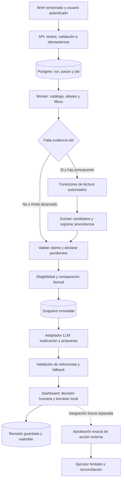

# Workflow, seguridad y observabilidad para el dataset adquirido

Fecha de consulta: **2026-09-28**. Fase 2, posterior al [gate de adquisición](../checkpoints/phase-1-gate.md). Informe de investigación: no modifica la aplicación ni aprueba implementación. Las propuestas siguientes son recomendaciones; los hechos documentados y sus límites se identifican expresamente.

## Decisión

**Conservar el monolito modular TypeScript, Next.js + worker Node, Postgres, pg-boss y adaptador directo de modelo. Ampliar un workflow acotado de investigación y preparación de contenido, sin introducir ahora un framework de agentes, múltiples agentes ni publicación automática en Luma.**

El valor que este dataset permite probar es reconstruir antecedentes, comparar alternativas con fuentes y preparar una decisión o un borrador local. No permite todavía demostrar retorno comercial, predecir asistencia ni declarar al mejor organizador. La autonomía útil consiste en resolver huecos concretos dentro de un presupuesto; no en entregar al modelo el control del ranking, los permisos o la persistencia.

## 1. Evidencia interna y consecuencia arquitectónica

**Hechos internos documentados, no una nueva auditoría del código:** el [gate](../checkpoints/phase-1-gate.md) registró un checkpoint de 87 ediciones y 24 comparaciones funcionales —8 casos sintéticos por 3 métodos—. Son cifras preliminares; los artefactos consolidados posteriores prevalecen. La similitud evaluada era taxonómica, sin embeddings. No existían etiquetas humanas de relevancia ni resultados propios autorizados para medir retorno. Más historia amplió candidatos, pero no demostró precisión ni disposición a pagar.

La [arquitectura vigente](../../../architecture.md) ya documenta runs y pasos persistidos, identidad por tenant, snapshots inmutables, validación JSONB, presupuestos de proveedores y recuperación. El modelo interviene después del snapshot factual y no gobierna elegibilidad, orden ni scores. Tampoco existe aún una política comercial de scoring aprobada. Esto debe conservarse; los pesos experimentales del research no deben convertirse en una política de inversión por accidente.

**Inferencia:** el cuello de botella visible es calidad y cobertura de evidencia, definición de resultados y evaluación humana. El tamaño del lote no justifica otra base de datos, entrenamiento propio ni cargar el corpus completo en cada prompt. El lote diverso muestra casos que requieren lógica de dominio: cancelación, fechas incompletas, organizaciones con varios roles y contadores de interfaz con significado limitado. Véase la [revisión de ocho ediciones](lote-eventos-diversos.md).

## 2. Qué tomar de la documentación externa

| Alternativa | Hecho externo comprobado | Decisión para este repo |
|---|---|---|
| Workflow con adaptador directo | Anthropic distingue caminos predefinidos de agentes que deciden dinámicamente sus pasos; recomienda añadir complejidad cuando aporte resultados medibles. El artículo es de diciembre de 2024 y hoy advierte que el panorama de herramientas cambió. [Fuente](https://www.anthropic.com/engineering/building-effective-agents) | Mantener como patrón de arquitectura, no usarlo como catálogo actual de productos. Nuestros pasos y límites son conocidos. |
| OpenAI Agents SDK | El loop corre en la aplicación; el equipo sigue siendo responsable del despliegue, herramientas, almacenamiento y decisiones de aprobación. Hay SDKs TypeScript y Python. [Fuente](https://developers.openai.com/api/docs/guides/agents/sdk) | No migrar solo para obtener herramientas tipadas. No elimina el trabajo ya resuelto de tenants, evidencia, idempotencia ni snapshots. |
| LangGraph | Separa checkpoints del estado de un hilo y stores entre hilos. Su documentación advierte que `MemorySaver` pierde datos al reiniciar y señala alternativas persistentes. [Fuente](https://docs.langchain.com/oss/javascript/langgraph/persistence) | Reevaluar si aparecen ramas, pausas y replays que el workflow actual ya no pueda mantener con claridad. Hoy duplicaría parte de la infraestructura. |
| MCP | Estandariza descubrimiento y llamadas a herramientas, esquemas y resultados; exige controles de entrada y acceso en el servidor. [Fuente](https://modelcontextprotocol.io/specification/2026-07-28/server/tools) | Usarlo cuando un conector concreto lo necesite. No sustituye el workflow ni la autorización. No montar un servidor MCP interno para funciones que ya comparten proceso. |

No se realizó benchmark de rendimiento de frameworks. LlamaIndex no se incorporó a esta comparación: todavía no hay un problema de recuperación documental medido que requiera evaluar otro framework. Esto es una decisión de alcance, no una afirmación de inferioridad técnica.

## 3. Ejecución propuesta y fronteras de autoridad

**Recomendación:** un run utiliza una versión del brief y una fecha de evaluación. La geografía procede del brief aprobado; este estudio no fija SF ni un segmento comercial. Los conectores devuelven datos candidatos. El servicio decide qué se admite y la UI distingue hechos, declaraciones de una fuente, inferencias y pendientes.

1. **Recuperar antes de adquirir.** SQL para ediciones, fechas, roles, costes, permisos y revisiones; búsqueda lexical y aliases para nombres de empresas y eventos. Recuperar antecedentes históricos separados de oportunidades futuras. RAG significa entregar solo fragmentos pertinentes con IDs, no introducir todos los documentos ni el historial completo de conversación. Embeddings quedan sujetos a un experimento de recuperación multilingüe con etiquetas.
2. **Adquirir por huecos.** El sistema identifica campos faltantes: edición exacta, organizador, papel de una empresa, coste o definición de una métrica. El modelo puede sugerir consultas; código valida proveedor, dominio, fechas, número de consultas, deadline y reserva monetaria. Un resultado de búsqueda sigue siendo una pista hasta abrir su fuente.
3. **Extraer sin promover automáticamente.** Una extracción crea candidatos con fuente, fragmento/locator y versión del extractor. Validadores admiten o rechazan forma, identidad y consistencia. La evidencia de una declaración del organizador prueba que la declaró; no prueba que su resultado sea verdadero.
4. **Comparar sin inventar política.** Elegibilidad antes que afinidad. Mostrar restricciones, costes comparables, incertidumbre y antecedentes. Una puntuación experimental queda identificada como tal y fuera del ranking comercial hasta que se apruebe su política y evaluación.
5. **Explicar con referencias cerradas.** El modelo recibe claims admitidos y puede proponer redacción y preguntas. No cambia valores ni orden. Para afirmaciones factuales se conserva la composición con claims del servidor. Validar que un ID existe no basta para validar una frase libre: si se permite paráfrasis, añadir revisión semántica/evaluación y no prometer garantía determinística de veracidad.
6. **Terminar de manera útil.** Límite, proveedor inaccesible o evidencia insuficiente producen un dossier parcial explícito, no una ronda ilimitada ni relleno con seeds vencidos. Reabrir recupera el snapshot original; actualizar fuentes genera una revisión nueva.

### Contratos de capacidades

Son interfaces de dominio propuestas, no nombres de endpoints ya implementados. El tenant se deriva de sesión, nunca de un argumento elegido por el modelo.

| Capacidad | Entrada acotada | Salida | Autoridad y permiso |
|---|---|---|---|
| Consultar catálogo | Brief versionado, fecha, filtros, límite | IDs de edición y revisiones | Lectura SQL con ámbito autorizado |
| Leer dossier | ID de edición y snapshot opcional | Claims, fuentes, contradicciones, pendientes | Lectura; históricos y vigencia separados |
| Investigar hueco | Tipo de campo, edición, consulta aprobada | URLs candidatas e intentos registrados | Lectura externa; tope de coste y tiempo |
| Leer fuente | URL validada y política de conector | Extracto, metadatos, estado de acceso | Sin shell, sin navegación autenticada arbitraria |
| Proponer explicación/concepto | Claims admitidos, brief mínimo | Referencias y contenido propuesto | Modelo sin permisos de publicación ni SQL libre |
| Guardar decisión/borrador | Snapshot, elección, motivos, condiciones, versión esperada | Revisión persistida | Acción explícita del usuario, control de concurrencia |
| Exportar contenido local | ID y versión del borrador | Texto/archivo revisable | No crea un evento en terceros |
| Crear evento externo, futuro | Acción exacta aprobada | ID remoto o estado incierto | Ejecutor separado, credencial acotada, permiso comprobado |

## 4. Estado durable, evidencia y memoria

**Recomendación basada en la arquitectura existente:** mantener un único registro de autoridad para `run`, `step`, revisiones, reservas y decisión. Separar estado de ejecución y evidencia de dominio: un paso exitoso no convierte su contenido en verdad. Guardar versiones de contrato, extractor, política, prompt y modelo para reconstruir por qué se produjo un resultado.

| Memoria | Representación útil | Lo que no debe ocurrir |
|---|---|---|
| Trabajo | Brief mínimo, claims seleccionados y pasos pendientes del run | Acumular todas las páginas o todos los chats en el contexto |
| Semántica | Afirmaciones revisionadas por entidad/edición, fecha, alcance, fuente y estado | Convertir un resumen del LLM en un hecho durable sin soporte |
| Episódica | Snapshot visto, elección, motivo, condiciones y revisiones de borrador | Tratar un descarte como fracaso de campaña o una aceptación como ROI |
| Procedural | Contratos, políticas y prompts versionados y revisados | Permitir que una web o una conversación reescriban permisos o reglas de scoring |

Por claim, conservar valor y unidad, sujeto y edición, estado observado/declarado/inferido/desconocido, fecha del hecho, fecha de publicación si existe, consulta, vigencia y precisión temporal/geográfica. Asociar URL, editor, método de acceso, locator/extracto permitido, identidad de contenido y derechos de uso conocidos o pendientes. La confianza sobre una afirmación y el acuerdo humano con una decisión son campos distintos.

Una URL compartida por varias fechas no identifica por sí sola una edición. La arquitectura ya registra un riesgo de URLs Luma reutilizadas entre años. El lote Circular añade otro caso de reutilización entre sesiones. Debe mantenerse el vínculo serie → edición → publicación y conservar conflictos; nunca deduplicar ciegamente por URL.

**Recuperación:** reanudar desde el último paso confirmado y evitar repetir efectos locales por entrega duplicada. Conservar deadline y reserva entre intentos. La arquitectura actual ya describe el caso de petición Exa despachada cuya respuesta se pierde: estado incierto y sin reenvío automático. Aplicar el mismo principio a escrituras futuras; una cola durable no garantiza exactamente una acción remota.

## 5. Borrador local y acción externa son productos diferentes

**Hecho externo:** la referencia de Luma documenta creación de evento, requiere `name`, `start_at` y `timezone`, permite visibilidad privada y cierre de registro, y no muestra un estado `draft` en el contrato consultado. También documenta comunicaciones de registro y recordatorios. No se ejecutó esta API. [Create Event](https://docs.luma.com/reference/post_v1-events-create).

**Recomendación inmediata:** producir `borrador_local` con título, audiencia propuesta, agenda, CTA, inspiración por campo y pendientes. No inventar fecha para completar el contrato, ni convertir lugar sugerido en reserva, ni sponsors históricos en acuerdos actuales. El [análisis de acceso](acceso-fuentes-y-luma.md) distingue las vías REST/MCP y sus límites; este informe no amplía esas autorizaciones.

Para una futura integración, aprobación de contenido y autorización de creación/publicación/invitaciones deben ser decisiones separadas. Antes de cualquier efecto, mostrar cuenta/calendario, destinatarios si aplica, fecha y zona, lugar, visibilidad, registro, precio, comunicaciones y payload final. Guardar actor, acción, versión, hash del payload y caducidad. Si cambian campos, permiso o destino, invalidar aprobación. Una acción `private` sigue siendo una escritura externa.

La guía del Agents SDK documenta interrupciones y estado reanudable para aprobar o rechazar una herramienta, y distingue guardrails bloqueantes de paralelos. Los paralelos pueden dejar empezar trabajo antes del veredicto. Es un precedente útil de diseño; no requiere adoptar ese SDK. [Guardrails y revisión humana](https://developers.openai.com/api/docs/guides/agents/guardrails-approvals).

**Política propuesta:** validación de permisos y aprobación bloqueantes antes del dispatch; credenciales solo en el ejecutor. Registrar intento antes de la petición. Usar idempotencia externa únicamente si el proveedor la documenta y se verifica. Si se pierde la respuesta, marcar `resultado_incierto`, consultar/reconciliar con una vía soportada y evitar reintentos de creación a ciegas. No considerar “copiado” como “creado”, ni “creado” como “publicado” o “invitados contactados”.

## 6. Threat model aplicado al corpus

MCP aclara que sus annotations son indicios, no controles de seguridad; un servidor puede mentir y esas etiquetas no inmunizan al modelo contra prompt injection. [Explicación de los mantenedores](https://blog.modelcontextprotocol.io/posts/2026-03-16-tool-annotations/). **Las mitigaciones siguientes son nuestro diseño propuesto**, no una certificación de seguridad del repo.

| Amenaza concreta | Frontera y control | Prueba necesaria |
|---|---|---|
| Descripción HTML/JSON-LD pide ignorar reglas y enviar el brief a una URL | Fuente siempre como datos; extractor sin secretos ni herramientas de escritura; salida con esquema; destinos externos decididos por código | Fuente adversarial no cambia herramientas, permisos ni campos admitidos |
| Página afirma “sponsor verificado” o inserta empresa en agenda | Claim tipado y soporte por papel/edición; no equiparar speaker, host, partner y sponsor | Empresa de un ponente no entra como sponsor sin evidencia del papel |
| Varias URLs repiten el mismo comunicado | Linaje y clusters de sindicación; independencia de evidencia separada de cantidad de enlaces | Duplicados no elevan automáticamente confianza |
| Métrica ambigua o evento cancelado | Guardar definición, denominador, estado y quién reporta | `148 Went` no se vuelve asistencia auditada; inscritos de Cape Town no se vuelven asistentes |
| URL conduce a servicios internos o cambia destino | Allowlist, HTTPS, validación de cada redirect, bloqueo de redes privadas y control de egress | IP local, metadata y DNS/redirect adversariales no son accesibles |
| Modelo fabrica tenant, ID de snapshot o aprobación | Tenant desde principal autenticado; autorización por recurso y operación; RLS | Tenant señuelo no puede leer, mutar ni aprobar datos ajenos |
| Texto malicioso persiste como memoria | Misma frontera de confianza al recuperar que al ingerir; procedencia intacta | Claim almacenado no se transforma en instrucción en el siguiente run |
| Fuga mediante trazas o proveedor | Brief mínimo, sin secretos ni listas privadas; metadatos por defecto | Exportación de trazas no contiene cookies, claves, nombres de invitados ni presupuesto confidencial |
| Retry consume saldo o crea duplicados | Reservas persistidas, límites globales y por run, estados inciertos y reconciliación | Reinicio en cada frontera no reinicia presupuesto ni repite una escritura incierta |

La guía MCP detalla validación de audiencia de tokens, mínimo privilegio y riesgos SSRF incluyendo redirects y DNS. Aplicamos por analogía las defensas de URL a lectores de fuentes; la guía las presenta específicamente para descubrimiento OAuth. [Seguridad MCP](https://modelcontextprotocol.io/docs/2026-07-28/tutorials/security/security_best_practices).

El parser que no ejecuta JavaScript no neutraliza instrucciones escritas en texto visible. Tampoco una fuente oficial garantiza precisión comercial. El objetivo es reducir capacidad de daño y medir fallos residuales, no prometer que un prompt “seguro” elimina el riesgo.

## 7. Observabilidad útil y privada

**Hechos externos:** OpenTelemetry documenta atributos de modelo, tokens y terminación, y métricas de duración y consumo. Su ejemplo captura contenido solo al habilitarlo. [Guía GenAI](https://opentelemetry.io/blog/2026/genai-observability/). La página antigua de convenciones indica que se trasladaron al [repositorio GenAI](https://github.com/open-telemetry/semantic-conventions-genai); no usar enlaces antiguos como garantía de un esquema estable. [Aviso de traslado](https://opentelemetry.io/docs/specs/semconv/gen-ai/).

**Recomendación:** fijar versión de instrumentación/convenios antes de implementar y usar spans por API, job, intento y paso. Correlacionar reanudaciones con `run_id` y contexto persistido; una sesión larga no obliga a mantener un span abierto durante días. Las trazas permiten diagnosticar; Postgres conserva el registro de negocio aunque haya muestreo o pérdida de telemetría.

| Medición | Definición para Growth Atlas |
|---|---|
| Latencia | Tiempo a primer dossier útil y a resultado final; p50/p95 separados por cache, adquisición, proveedor y fallback |
| Coste | Tokens de entrada/salida/caché si el proveedor los informa; tarifas versionadas; reservas separadas de gasto conocido y de saldo facturado |
| Cobertura factual | Campos necesarios con soporte, pendientes, contradicciones y frescura; denominador explícito por tipo de decisión |
| Calidad del modelo | Referencias inválidas, claims sin soporte, correcciones humanas y fallbacks; una respuesta válida como JSON no cuenta como correcta |
| Fiabilidad | Reanudaciones, jobs repetidos, tiempo en espera, resultados inciertos, conflictos de revisión y fallos de proveedor |
| Utilidad | Tiempo humano hasta una decisión revisable, antecedentes relevantes etiquetados, correcciones del borrador; aceptación separada de éxito comercial |
| Seguridad | Intentos bloqueados por permisos/URL, aprobación obsoleta, pruebas adversariales; nunca guardar el secreto para explicar el bloqueo |

Emitir IDs opacos, versiones, códigos de resultado y contadores. No registrar prompts, páginas completas, argumentos sensibles ni credenciales por defecto. Limitar cardinalidad de métricas: IDs y URLs van, cuando corresponda, en trazas protegidas, no como etiquetas de cada histograma. Auditoría de decisiones sin muestreo; telemetría operativa con retención y acceso definidos.

OpenTelemetry recomienda minimizar datos y revisar lo emitido por librerías; sus procesadores pueden eliminar, filtrar o redactar atributos. **Recomendación:** allowlist de atributos desde origen y una segunda barrera en el Collector; acceso temporal y explícito para depuración con contenido. Un hash no convierte automáticamente datos personales en anónimos. [Datos sensibles](https://opentelemetry.io/docs/security/handling-sensitive-data/).

## 8. Experimentos y criterios antes de ampliar autonomía

**No ejecutados en este subtrabajo; son propuestas.** Congelar versiones de fuentes y casos, separar validación de desarrollo de una muestra reservada y evitar que una etiqueta aparezca dentro del prompt.

| Experimento | Comparación controlada | Resultado exigido para decidir |
|---|---|---|
| Recuperación multilingüe | SQL/lexical/taxonomía frente a híbrida con embeddings; mismos briefs y corpus | Etiquetas humanas muestran mejores antecedentes relevantes y restricciones conservadas a coste aceptable |
| Explicación del modelo | Reporte factual determinístico frente a explicación/concepto con referencias | Menos trabajo humano sin más claims falsos; contabilizar abstenciones y correcciones |
| Investigación por huecos | Catálogo solamente frente a consultas acotadas | Evidencia nueva que cambia una condición útil; coste por hueco resuelto, no por URL encontrada |
| Draft local | Brief preparado frente a proceso actual del equipo | Tiempo y correcciones observados; ninguna publicación necesaria para medirlo |
| Worker durable | Interrumpir antes/después de persistencia y de respuesta externa simulada | Run recuperable, snapshot reproducible, tenants aislados y sin repetir efectos inciertos |

Casos reales para convertir en oráculos: Cape Town cancelado e inscritos; Polkadot `Went`; Circular con año inferido y URL compartida; ciudad desconocida de Retail Lab; tarifa gratuita con restricciones de acceso de Alliance; evento futuro anunciado sin resultado; sponsor por edición frente a afiliación de speaker. La [muestra auditada](lote-eventos-diversos.md) no convierte todo el corpus en auditado. Añadir variantes adversariales sintéticas claramente separadas de los registros reales.

### Cuándo tendría sentido más de un agente

Primero paralelizar I/O independiente con workers normales. Si persiste un problema medido, el candidato experimental es **extracción de dossiers independientes**, cada uno con corpus acotado y salida normalizada; otro candidato es verificar soporte de claims sin autoridad de escritura. No son candidatos válidos dos agentes negociando el score o una “votación” que convierta repetición en certeza.

Comparar contra el mismo modelo en workflow único, con mismos datos, herramientas, presupuesto total y deadline. Medir errores de soporte, relevancia humana, duplicados, consistencia de entidades, p95 y coste por resultado útil. Preregistrar con el equipo el mínimo beneficio y máximo coste admisibles; no elegirlos después de ver resultados. Mantener todos los controles de seguridad como requisito de paso. Sin mejora repetible sobre una muestra reservada, conservar una sola ruta.

El patrón de Anthropic separa paralelización de subtareas independientes de un orquestador que descubre dinámicamente qué subtareas existen. Nuestro pipeline ya conoce la mayoría de ellas. [Patrones de workflow](https://www.anthropic.com/engineering/building-effective-agents).

## 9. Decisiones abiertas y límite de la conclusión

- **DECISIÓN ABIERTA:** comprador, geografía y decisión prioritaria de la siguiente prueba; los ocho casos sintéticos no resuelven segmentación.
- **DECISIÓN ABIERTA:** qué etiqueta humana define una recomendación útil y quién la adjudica; acuerdo entre evaluadores no equivale a confianza sobre hechos del mundo.
- **DECISIÓN ABIERTA:** política comercial de scores y tolerancia a costes; hasta entonces comparación factual y prioridades de investigación.
- **DECISIÓN ABIERTA:** retención/licencia de fuentes, permisos de integración y límites de observabilidad según cuentas reales.
- **DECISIÓN ABIERTA:** necesidad comercial y autorización para escribir en Luma; actualmente se recomienda contenido local revisable.

Se consultaron 12 fuentes primarias, con hechos breves y límites en [workflow-sources.json](../batches/workflow-sources.json). No se midió latencia, coste real ni seguridad de una implementación nueva, ni se conectaron cuentas o ejecutaron modelos/agentes para este informe.

**Decisión práctica:** conservar la arquitectura y comprobar, sobre el corpus adquirido, el recorrido brief → antecedentes con evidencia → comparación con pendientes → decisión guardada → borrador local. Instrumentar y evaluar esa ruta. Posponer otra infraestructura y acciones externas hasta que un experimento y un permiso concretos las justifiquen.
